# Database

Schema and data model only. Read `PROJECT_BIBLE.md` first for business context — this file explains the *why* behind the schema; `Hope/backend/prisma/schema.prisma` is always the exact, literal source of truth for field names/types/enums. If this file and the schema ever disagree, trust the schema and fix this file.

## 🔴 Known issue — vehicle ownership model is wrong, fix before extending

`Vehicle.transporterId` (optional FK to `Transporter`) was implemented and used throughout the app as "which transporter owns/uses this vehicle." **That's backwards.** Per `PROJECT_BIBLE.md`: the Fleet Owner (the `Organization`) owns every vehicle — outright, on lease, or on EMI. Transporters are load-brokers who never own or supply vehicles.

What needs to happen (not yet designed in detail — needs a client conversation first):
- Figure out what `transporterId` on Vehicle was *actually* meant to represent. The `ownershipStatus` enum (`OWNED`/`ATTACHED`/`LEASED`) hints it might mean "this vehicle is attached/leased **from** an external party" — but that external party is a *vehicle source*, not a load-broker `Transporter`. Conflating the two into one table is the root problem. Likely fix: either drop `Vehicle.transporterId` entirely, or add a separate `VehicleOwner`/`VehicleSource` entity distinct from `Transporter`.
- Add EMI/loan tracking: no such model exists today. Needs something like a `VehicleLoan` model — lender, principal, EMI amount, due day, tenure, remaining balance — plus a way to log each EMI payment as a recurring liability (probably a new `VehicleExpenseCategory` value, e.g. `EMI`, alongside the existing `REPAIR`/`MAINTENANCE`/`TYRE`/`BATTERY`/`INSURANCE`/`PERMIT`/`OTHER`).
- Don't build vehicle P&L / profitability reports until this is fixed — the numbers would be wrong (EMI cost isn't tracked, so "vehicle profitability" currently only sees trip revenue and ad-hoc repair costs).

## Other known gaps

- **No auth/session layer.** `Hope/backend/src/context.js`'s `getOrganization()` just grabs the first `Organization` row in the table — a single-tenant shim. The schema is already multi-tenant-*shaped* (every model carries `organizationId`), but nothing resolves *which* org a request belongs to. Needed for the MSSP multi-client model in `PROJECT_BIBLE.md`.
- **Driver outstanding-balance formula is not a true net balance.** `calculateDriverOutstanding` in `Hope/backend/src/services/calculations.js` sums `settlementTotal` (every `DriverSettlement` type — `SALARY`, `ADVANCE`, `DEDUCTION`, `PENALTY`, `CASH_COLLECTED`, `ALLOWANCE` — all added together as positive numbers, never netted against each other) + `tripExpensesPaid` + accrued daily bhatta. This reads as "total money that has moved" more than "amount currently owed." Needs an explicit business-rule decision from the client on how each settlement type should affect the sign of the balance before this gets rewritten.
- **`Party` model exists but is unused.** Client confirmed it's out of scope for now.
- **`Bank`/`Road` marker** seen in the client's handwritten ledger — inferred to mean "collected physically" vs. "bank transfer," but this is a guess, not confirmed. No corresponding field exists yet. See `DECISIONS.md`.

## Entity-relationship diagram (current schema, core flow)

```mermaid
erDiagram
    ORGANIZATION ||--o{ USER : employs
    ORGANIZATION ||--o{ TRANSPORTER : "works with (brokers)"
    ORGANIZATION ||--o{ VEHICLE : owns
    ORGANIZATION ||--o{ DRIVER : employs
    ORGANIZATION ||--o{ ROUTE : defines
    ORGANIZATION ||--o{ TRIP : runs
    ORGANIZATION ||--o{ DOCUMENT : stores

    TRANSPORTER ||--o{ TRIP : "brings load for"
    TRANSPORTER ||--o{ RATE_CARD : has
    TRANSPORTER ||--o{ TRANSPORTER_LEDGER_ENTRY : "billed via"
    TRANSPORTER ||--o{ PAYMENT : pays

    VEHICLE ||--o{ TRIP : "used on"
    VEHICLE ||--o{ VEHICLE_EXPENSE : incurs

    DRIVER ||--o{ TRIP_DRIVER : "assigned via"
    DRIVER ||--o{ TRIP_EXPENSE : "paid directly (advances)"
    DRIVER ||--o{ DRIVER_SETTLEMENT : "settled via"

    ROUTE ||--o{ RATE_CARD : "priced by (per transporter)"
    ROUTE ||--o{ TRIP : "travelled on (optional)"

    TRIP ||--o{ TRIP_DRIVER : "1-to-many drivers"
    TRIP ||--o{ TRIP_EXPENSE : incurs
    TRIP ||--o{ PAYMENT : "receives (many, over time)"
    TRIP ||--o{ TRANSPORTER_LEDGER_ENTRY : "posts one entry to"

    ORGANIZATION {
        string id PK
        string name
        string language "hi | en"
    }
    TRANSPORTER {
        string id PK
        string firmName
        enum commissionType "PERCENTAGE | FIXED_PER_TRIP | FIXED_PER_TON"
        float commissionValue
    }
    VEHICLE {
        string id PK
        string vehicleNumber
        enum ownershipStatus "OWNED | ATTACHED | LEASED — see Known Issues"
        string transporterId FK "WRONG — see Known Issues"
    }
    DRIVER {
        string id PK
        string name
        float monthlySalary
        float dailyExpenseRate "bhatta per day while on a trip"
    }
    ROUTE {
        string id PK
        string origin
        string destination
        float distanceKm
    }
    TRIP {
        string id PK
        string transporterId FK
        string vehicleId FK
        string routeId FK "optional"
        enum status "DRAFT|LOADING|IN_TRANSIT|DELIVERED|POD_RECEIVED|BILLED|SETTLED|CANCELLED"
        enum paymentStatus "UNPAID|PARTIALLY_PAID|PAID|OVERPAID"
        float freightAmount
        string internalRef "auto-generated TRP-NNN if not supplied"
    }
    TRIP_DRIVER {
        string tripId FK
        string driverId FK
        string role "PRIMARY | RELIEF | CO_DRIVER"
    }
    TRIP_EXPENSE {
        string id PK
        string tripId FK
        enum category "FUEL|TOLL|FOOD|LOADING_UNLOADING|REPAIR_EN_ROUTE|EMERGENCY|DAILY_EXPENSE|OTHER"
        float amount
        string paidToDriverId FK "optional — money handed to a driver"
    }
    TRANSPORTER_LEDGER_ENTRY {
        string id PK
        string transporterId FK
        string tripId FK
        float freightCredited
        float commissionDeducted
        float netReceivable "freight - commission"
    }
    PAYMENT {
        string id PK
        string transporterId FK
        string tripId FK "optional"
        float amount
        enum paymentType "ADVANCE|DIESEL_ADVANCE|PART_PAYMENT|FULL_SETTLEMENT|OTHER"
        enum mode "CASH|BANK_TRANSFER|UPI|CHEQUE"
    }
    DRIVER_SETTLEMENT {
        string id PK
        string driverId FK
        string tripId FK "optional — advances can exist before a trip"
        enum type "SALARY|INCENTIVE|ADVANCE|DEDUCTION|PENALTY|CASH_COLLECTED|ALLOWANCE"
        float amount
    }
    VEHICLE_EXPENSE {
        string id PK
        string vehicleId FK
        enum category "REPAIR|MAINTENANCE|TYRE|BATTERY|INSURANCE|PERMIT|OTHER — no EMI yet, see Known Issues"
        float amount
    }
```



## Plain-language walkthrough per table

- **Organization** — the tenant. One row per fleet-owner client, eventually. `language` defaults `hi`.
- **User** — login account. Has a `role` (see `PROJECT_BIBLE.md` RBAC table). Can optionally link to a `Transporter` or `Driver` row for their future self-login views. Auth isn't wired up yet (see Known Gaps above).
- **Transporter** — a load-broker. Has a commission structure (percentage, fixed-per-trip, or fixed-per-ton) that's deducted from freight to compute what's actually payable to them net... no wait — deducted to compute what the transporter *owes back* isn't quite right either. Concretely: `TransporterLedgerEntry.netReceivable = freightCredited - commissionDeducted` is the amount the transporter owes the fleet owner for that trip, and `Transporter` list/detail endpoints expose `outstanding = sum(netReceivable) - sum(payments)`.
- **Vehicle** — owned by the Organization (see Known Issues for the current bug around `transporterId`). Carries document-expiry dates directly (`insuranceExpiry`, `pucExpiry`, `fitnessExpiry`, `permitExpiry`, `nationalPermitExpiry`) — no UI surfaces these yet.
- **Driver** — has `monthlySalary` and `dailyExpenseRate` (bhatta, accrued automatically per day while assigned to an in-progress trip, on delivery). Sensitive fields (`aadhaarNumber`, `panNumber`, `bankAccount`) are meant to be encrypted at rest — verify this is actually implemented before storing real driver data.
- **Route** — just origin/destination/distance. No `name` field — don't invent one in the UI (this was a real bug, fixed).
- **RateCard** — a transporter+route-specific rate, for auto-calculating freight. Optional; a trip's freight can also just be typed directly or computed from `weightTons × freightPerTon`.
- **Trip** — the center of the operational model. One vehicle, one transporter, N drivers (via `TripDriver`), N expenses, N payments over time, exactly one `TransporterLedgerEntry` (created on trip creation, reflecting the freight/commission split at that moment).
- **TripDriver** — join table, many-to-many Trip↔Driver with a `role`. This is how multi-driver trips and mid-trip driver changes are meant to be modeled — `leftAt` exists on the row but nothing sets it yet, meaning **there's no real "driver swap" tracking today** despite the field existing. This is exactly the "trip timeline" feature the client asked for (see `IDEAS.md`).
- **TripExpense** — fuel, toll, food, loading/unloading, en-route repair, emergency, or the auto-generated `DAILY_EXPENSE` (bhatta) rows. Can optionally be tagged `paidToDriverId` when the money went through a driver's hands.
- **TransporterLedgerEntry** — one row per trip, generated automatically, never hand-edited. This is the "ledger is king, not invoices" rule from `PROJECT_BIBLE.md` made concrete.
- **Payment** — money received from a transporter. `tripId` is optional (a payment can be a general advance not yet tied to a specific trip). `paymentType` covers the classification the client explicitly asked for (advance / diesel advance / part payment / full settlement / other).
- **DriverSettlement** — money moved to/from a driver, independent of the trip billing cycle. `tripId` is optional — an advance can exist before any trip does, per the client's confirmed business rule.
- **VehicleExpense** — non-trip vehicle costs (repair, maintenance, tyres, battery, insurance, permit). This is where EMI tracking should eventually live (see Known Issues).
- **Document** — polymorphic (`entityType` + `entityId` point at Vehicle/Driver/Trip/Organization). Schema exists, no UI built yet.

## Financial formulas actually implemented (as of this doc)

```
Trip freight        = freightAmount if set, else weightTons × freightPerTon
Transporter commission on a trip:
  PERCENTAGE       → freightAmount × (commissionValue / 100)
  FIXED_PER_TRIP   → commissionValue
  FIXED_PER_TON    → commissionValue × weightTons
Trip net receivable  = freightAmount − commission            (→ TransporterLedgerEntry)
Trip outstanding     = netReceivable − sum(payments on trip)
Transporter outstanding = sum(all TransporterLedgerEntry.netReceivable) − sum(all Payment.amount)
Driver "outstanding" = sum(all settlement amounts, all types) + sum(trip expenses paid to driver)
                        + sum(accrued daily bhatta)
                        ⚠️ not a true net balance — see Known Gaps above
```

All in `Hope/backend/src/services/calculations.js`. Bulk variants (`*Bulk`) compute these for many rows in 2 `groupBy` queries instead of N+1 — use those on any list/report endpoint.
