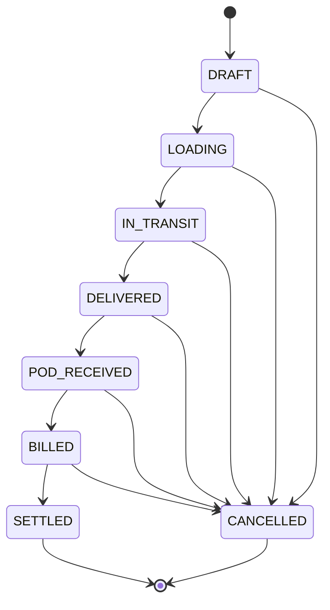

# Transit Ledger

> Fleet Operating System for Indian Transport Businesses

**Start here.** This is the single source of truth for what this product is and why. Before touching schema or money logic, also read `DATABASE.md`. Before picking up work, check `TASKS.md` (status) and `DECISIONS.md` (settled calls + open questions). This doc set is frozen at six files — do not create new top-level docs; extend one of these instead.

| Field | Value |
|---|---|
| Project | Transit Ledger |
| Repository | https://github.com/5h1Vm/Transport-ERP |
| Status | Working POC, pre-launch, single client onboarding in progress |
| Product type | Multi-tenant SaaS (MSSP model — eventually many fleet-owner clients, each isolated) |
| Target users | Fleet Owner, Dispatcher, Accountant (Driver and Transporter self-login are schema-ready, not built) |

## What this is

Transit Ledger replaces a fleet owner's handwritten khatabooks, WhatsApp message history, and phone-call memory with one connected system for trips, payments, driver settlements, documents, and transporter balances. It is **not** generic logistics software and it is **not** an accounting suite — it is ledger-first, built around the question "how much money is where, right now."

**Design philosophy:** the software adapts to the business, not the other way round. The owner already thinks in terms of "khata", "trip", "driver", "payment" — the product should speak that language, not force SAP-style workflows onto someone who currently runs the business from a notebook and WhatsApp.

## The business model — read this before writing any code that touches vehicles or transporters

```
Party (has a load)
   │
   │ calls/WhatsApps
   ▼
Transporter  ──────────────  a BROKER. Brings loads. Does NOT own trucks.
   │                          Owes the Fleet Owner money after a trip (this is
   │ contacts                 the actual customer relationship, receivable-side).
   ▼
Fleet Owner (our client)  ──  OWNS the trucks. Owned outright, rented, or on EMI.
   │                          EMI = a recurring liability against that vehicle,
   │ assigns                  tracked separately from trip cost.
   ▼
Driver + Vehicle (his own)
   │ delivers, sends POD via WhatsApp
   ▼
Owner forwards POD to Transporter, sends bill
   │
   ▼
Transporter pays Owner (often in parts, over time, various modes)
```

**The transporter is the customer, not the vehicle supplier.** Every vehicle belongs to the Fleet Owner (or is on lease/EMI to the Fleet Owner) — never to a transporter. Confirmed by client, multiple times, independently: *"Vehicles may be Company Owned, Purchased on EMI, Leased, or Rented. The system should not assume ownership type."*

🔴 **Current known bug (see `DATABASE.md` → Known Issues):** the schema has `Vehicle.transporterId`, and the app was built treating it as "which transporter owns/uses this vehicle" — backwards from the model above. Fix this before building more vehicle-dependent features (trip P&L, vehicle profitability reports). No EMI/loan tracking exists in the schema at all yet.

**Party** (the transporter's own customer) exists in the schema but the client confirmed **it is out of scope for now** — "no need for Party as we are not supposed to contact them directly." Don't build Party-facing features unless this changes.

## How a trip actually works today (confirmed by client, on call)

1. Transporter calls/WhatsApps the dispatcher (usually the owner) — shares pickup, destination, material, weight, freight amount, loading date.
2. Owner checks his own truck + driver availability, assigns them. A trip is created.
3. During loading/transit: driver may need a cash advance, diesel money, may receive money directly from the transporter or party — every one of these is a financial movement that must be captured, because it affects settlement later.
4. Delivery happens. Driver sends a POD photo via WhatsApp.
5. Dispatcher forwards the POD to the transporter, sends the bill.
6. Transporter pays — often in parts, over time, across cash/UPI/bank transfer/cheque.
7. Driver settlement happens separately from the trip billing: salary, advances, daily bhatta (fixed rate per day while on a trip), incentives, deductions, cash the driver collected directly.

No formal LR (Lorry Receipt) is generated today — it's all handwritten. A printable LR generator is an acceptable **future** feature, explicitly not MVP.

## Trip lifecycle (state machine, enforced server-side)



Marking a trip `DELIVERED` auto-accrues each assigned driver's daily bhatta (`dailyExpenseRate × trip duration in days`) as expense rows. This is implemented (`Hope/backend/src/routes/trips.js`).

## What the two handwritten ledger types imply

The client's actual paper records split into two distinct patterns — this shaped the data model:

1. **Cash-out register** — just "person, amount, done." Driver advance, fuel advance, emergency payment, petty cash. No calculation, no invoice. → This is `DriverSettlement` (types: `ADVANCE`, `CASH_COLLECTED`, etc.) and `TripExpense`, **not** a heavy accounting module.
2. **Trip settlement ledger** (the "KPMG notebook") — one row per trip: freight = quantity × rate (never typed directly), route, a `Bank`/`Road` marker (⚠️ meaning unconfirmed — see `DECISIONS.md`), and a settlement breakup (freight → less driver bata → less diesel → less commission → net payable). → This is `TransporterLedgerEntry` + `Trip.financialSummary`.

Hidden rules this implies, all already reflected in the schema: a trip can have **multiple** payments over time (never `Trip.payment`, always `Trip.payments[]`); the ledger is the product's home screen, not invoice PDFs; transporter balances matter more than any single invoice; driver advances can exist **before** a trip record does (a driver can ask for ₹5000 with no trip attached yet).

## Core business rules

- A trip has exactly one vehicle, belongs to one transporter, may have multiple drivers, multiple expenses, multiple payments over time.
- A vehicle cannot be active on two overlapping trips (not yet enforced in code — flag if this matters before launch).
- Drivers can switch vehicles trip to trip; never assume a permanent driver↔vehicle pairing.
- Payments can be partial, can exceed the outstanding balance (overpayment becomes credit), can land in different bank accounts.
- Fuel and trip-time costs belong to the **trip**. Vehicle repairs/maintenance belong to the **vehicle** (`VehicleExpense`, separate from `TripExpense`).
- Records are corrected via adjustment, never silently deleted — financial history must stay reconstructable.
- Negative balances are acceptable (e.g., a transporter paid an advance before the trip that earns it exists).
- Everything important should remain searchable later — this is a core expectation, not a polish item.

## RBAC (roles exist in schema, only partially enforced)

| Role | Sees |
|---|---|
| OWNER | Everything |
| MANAGER | Trips, fleet, drivers, transporters |
| DISPATCHER | Trip section only |
| ACCOUNTANT | Billing, ledgers, payments |
| TRANSPORTER (future self-login) | Only their own trips + outstanding balance |
| DRIVER (future self-login) | Only their assigned trips + expense submission, ideally Hindi-first |

No auth/session layer exists yet — see `DATABASE.md` → Known Issues and `TASKS.md`.

## UX direction (explicit, non-negotiable per product owner)

- **Light/whitish theme only. No dark theme, no toggle.** Clean, big tap targets, "feels like a khatabook, not SAP."
- **Workspace-driven, not CRUD-page-driven.** Every major entity answers one question: Trip Workspace = "what's happening on this trip?", Transporter Workspace = "how much do they owe?", Driver Workspace = "what's their current financial/operational status?", Vehicle Workspace = "how is this truck performing?", Dashboard = "what needs attention today?"
- **Mobile-first.** Desktop: persistent left sidebar. Mobile: sticky top header + bottom tab bar with a "More" sheet for overflow. Must never require a page refresh to navigate — this was a real bug, now fixed (see `CHANGELOG.md`).
- WhatsApp-style sharing matters (POD forwarding, payment follow-ups, document expiry reminders) — **without** the paid WhatsApp Business API. Use `wa.me` prefilled-text deep links.

## Dashboard priorities (in order)

Outstanding transporter balances → pending PODs → trips in progress → cash paid today → driver advances/cash-in-hand → expiring documents → trips needing attention.

## MVP module list

Authentication (not built), Dashboard, Vehicles, Drivers, Transporters, Trips, Payments, Driver Settlements, Documents (schema only, no UI), Reports (minimal), Settings (not built).

**Explicitly out of scope for now:** GPS tracking, FASTag integration, OCR, AI assistant features, a customer/transporter self-service portal, a dedicated driver mobile app, SMS gateway, Tally integration, offline sync, Party as a first-class entity, LR/bilty generation.

## Success criteria

The product works if the owner can answer these in under 30 seconds:
- Which transporter owes money, and how much?
- Which trips are still unpaid?
- Which driver currently holds company cash?
- Which vehicle earned the most this month?
- Which documents expire soon?
- Which trips are waiting for POD?
- What needs my attention today?

## Stack (see `DATABASE.md` for schema, `TASKS.md` for build status)

- Backend: Node.js + Express (CommonJS), Zod validation. Deployed as a Vercel serverless function (`Hope/backend/api/index.js`, region `bom1`).
- Database: PostgreSQL + Prisma. Neon (Singapore), provisioned through the Vercel marketplace integration, which injects `DATABASE_URL`.
- Frontend: vanilla JS SPA, no framework (deliberate constraint — keep it simple, keep it fast, keep it cheap to run). Vite build. Hosted on Vercel.
- Repo layout: `Hope/backend`, `Hope/frontend`.
