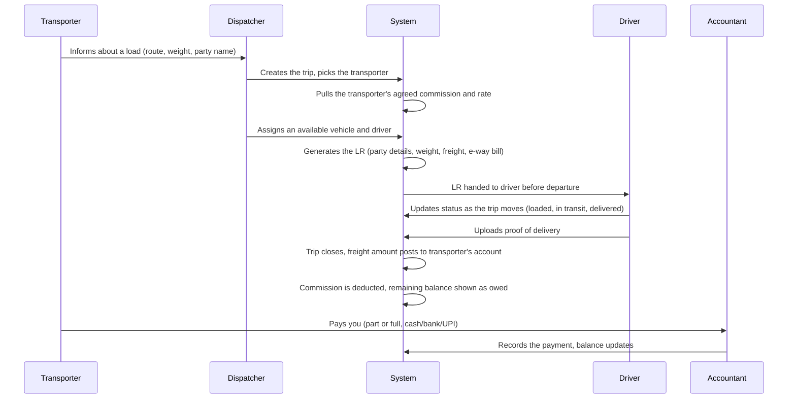
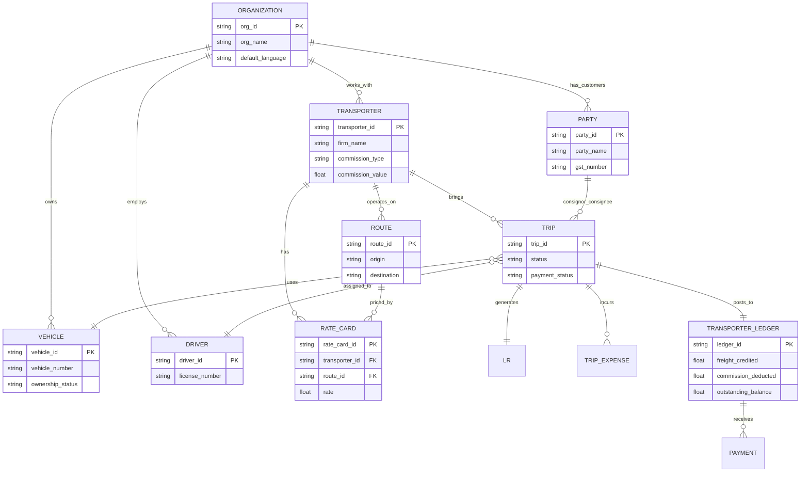

# Transport ERP Platform — Requirements Document

**Status:** DRAFT — Needs client walkthrough and sign-off before development starts

---

## 1. What This Document Is

This document explains what we are building, why, and in what order. It also has a set of questions we need answered by you (the client) before we lock the plan.

The business runs like this:

> **Party (your customer) pays the Transporter → Transporter pays you (the Fleet Owner)**

Transporters bring you business, deal with the party, collect the freight money, and pass it on to you after keeping their commission. Right now this is tracked on paper, in registers, and over phone calls — which makes it hard to know who owes what, and when. This system is meant to fix that.

---

## 2. What We Are Building Now (1-2 Week Goal)

- Master records for Vehicles, Drivers, Transporters, Parties, and Routes
- Trip creation, LR (Lorry Receipt) generation, and trip status tracking
- Transporter Ledger — the running account of who owes you, and how much
- Basic billing and payment recording
- Simple reports (outstanding amounts, trip summary)
- Web-based dashboard, usable on mobile browsers (not a separate app yet)
- WhatsApp alerts for important updates
- Hindi and English language support

## 3. Who Uses the System

| Role | What They Do | What They See |
|---|---|---|
| Admin (Internal, us) | Manages the system itself, monitors health, not visible to you or your team | Backend only — you will never see or interact with this |
| Owner (You) | Full view of your business — trips, money, everyone's work | Everything in your company |
| Manager | Runs day-to-day operations | Trips, fleet, drivers, transporters |
| Dispatcher | Creates and updates trips | Trip section only |
| Accountant | Handles billing and payments | Billing, ledgers, payments |
| Transporter | Sees their own account with you | Their own trips and outstanding balance only |
| Driver | Field staff | Their assigned trips, expense submission — kept as simple as possible, in Hindi |

---

## 4. How a Trip Should Work (Please Confirm)

Below is how we think a trip flows today, based on our conversations. **This is a guess based on typical practice in this business — not confirmed with you yet.** Please read this and tell us where it's wrong. The questions in Section 9 are meant to help you correct it.

**Things we don't actually know yet, and need from you (see Section 9):**
- What's the very first thing you note down when a trip starts — and where?
- How do you find out a delivery actually happened, today?
- What happens when there's a dispute about payment?

---

## 5. What Information the System Will Track

---

## 6. Modules — What's In Each One

| Module | What It Covers |
|---|---|
| 1. Master Data | Vehicle, Driver, Transporter, Party, Route records |
| 2. Trip & Dispatch | Trip creation, LR generation, status tracking |
| 3. Transporter Ledger | Who owes what, commission deduction, running balance |
| 4. Billing & Payments | Recording payments, basic outstanding reports |
| 5. Basic Reports | Trip summary, outstanding balances |
| 6. Fleet Maintenance | Service reminders, tyre/battery tracking |
| 7. Fuel & Expense Tracking | Fuel logs, efficiency, expense approvals |
| 8. Compliance Vault | Document storage with expiry alerts | 
| 9. Advanced Reports | Route profitability, driver performance, full P&L |
| 10. Fine-Grained Permissions | Detailed role-by-role access control |

---

## 7. Technical Commitments (Plain Terms)

| Area | What We're Committing To |
|---|---|
| Speed | Not a concern at current scale (50 vehicles). Built in a way that won't need to be rebuilt when usage grows. |
| Data Safety | Daily automatic backups of the database. Separate test and live environments, so changes are tested before they reach your real data. |
| Sensitive Data (Aadhaar, PAN, Bank Details) | Stored in encrypted form. Only Owner and Accountant roles can view this data. Never included in exported/downloadable reports. |
| Language | Hindi and English. Each company can set a default; each person can change it in their own settings. Driver-facing screens are Hindi by default. |
| Notifications | WhatsApp only for now (document expiry, trip updates, payment alerts). |
| Hosting | Cloud-based, kept as low-cost as possible while meeting the above. |

---

## 8. Future Enhancements (Not Part of the Initial Version)

The features are ideas for future phases once the core system is running smoothly and everyone is comfortable using it.

| Enhancement | Benefit |
|---|---|
| GPS Vehicle Tracking | View the live location of vehicles on a map instead of relying only on driver updates. |
| FASTag Integration | Automatically record toll expenses, reducing manual data entry. |
| Dedicated Mobile App | A faster experience for drivers and staff, with better support for poor network coverage. |
| Party Tracking Portal | Allow customers to check the status of their shipments themselves, reducing "Where is my load?" phone calls. |
| Tally Integration | Automatically synchronize ledger and payment data with your accounting software. |
| Automated Document Scanning | Capture RC, insurance, and other documents using a mobile camera, with details filled in automatically. |
| Route & Profitability Analysis | Understand which routes, vehicles, and transporters are the most profitable. |
| Predictive Maintenance | Receive maintenance suggestions based on actual vehicle usage rather than fixed schedules. |

These enhancements can be added later without changing the core system. The priority is to first replace the existing paper-based process with a simple, reliable digital workflow.

---

## 9. Questions We Need Answered 
#### (Please Walk Through This and Send a Voice Note)

The best way to answer these is to **pick one real trip from last week and describe it step by step** — not in general terms.

1. How did the trip start — who called or messaged whom, and what did they say?
2. What is the very first thing you write down, and where (register, WhatsApp, notebook)?
3. How do you decide which truck and driver go on this trip?
4. What paper is physically handed to the driver before he leaves?
5. When the truck reaches its destination, how do you find out — a call, a photo, or only when payment comes in?
6. How do you currently know money is owed to you? Do you check a register, or wait for the transporter to tell you?
7. When a transporter pays you, how does it happen (cash, bank transfer, cheque), and how do you note it down?
8. Has there been a case where a transporter said "the party hasn't paid me yet"? What did you do?
9. If you keep a register (like a bilty register), what columns does it actually have?
10. Does a transporter ever send you a photo of an LR, or is it usually just a phone call?

**A few smaller questions too:**

11. Roughly how many trips happen per week across all your trucks?
12. Roughly how many transporters do you actively work with?
13. Do your drivers have smartphones that can run a simple web app reliably?
14. Are you comfortable if Fleet Maintenance and Fuel Tracking arrive 2-3 weeks after the main system, instead of on day one?
15. What would make you feel this system was worth building, one month after you start using it?

---