# Transit Ledger — CTO-Grade Architecture, Product & Domain Review (v2)

**Method note:** this builds on a full read of `docs/*` (all six frozen files plus the untracked `deep-research-report.md`), `Hope/backend/prisma/schema.prisma`, every file in `Hope/backend/src`, and the core frontend flow (`main.js`, `store/`, `services/api.js`, representative pages/components). No code was changed. Every claim below is either traceable to a specific file/line, or explicitly marked as external domain knowledge/judgment rather than something read in the repo. Where a recommendation could be mistaken for fashion-driven engineering, I say directly why it isn't being made (or why something tempting is deliberately *not* being recommended).

---

## Executive Summary

Transit Ledger is a small, honestly-documented, pre-launch POC with genuinely good bones: the domain model (transporter-as-broker, fleet-owner-as-vehicle-owner, ledger-not-invoice) is correct and client-validated, the team already found and documented its two worst bugs before an outside review did, and the six-file frozen doc structure with a dated changelog and an open-questions log is more disciplined than most funded startups manage at this stage. It is not, today, safe to onboard a second paying tenant — not because the architecture is wrong, but because one specific, systemic gap (no tenant scoping on most read endpoints) turns "multi-tenant SaaS" from a schema shape into an active data-leak risk the moment a second `Organization` row exists.

**The one-sentence CTO takeaway:** ship the Critical fix-list in §Migration Playbooks before signing customer #2; everything else in this document is sequenced, not urgent, and most of it should explicitly wait.

**What this review will *not* recommend, stated up front because the brief asks for restraint:** microservices, Kubernetes, CQRS, Kafka, event sourcing, GraphQL, a graph database, or a service mesh. None of the actual problems in this codebase are solved by any of them. A modular monolith on a single Postgres instance, done correctly, comfortably carries this product to the 10,000-truck / 500K-trip milestone in the brief. The architecture work that matters here is unglamorous: tenant isolation, transactional integrity, money precision, and an append-only event log. Every one of those is boring, correct, and cheap relative to the alternative of not doing them.

---

## CTO Recommendations (ranked, do these in this order)

1. **Close the tenant-isolation gap** before any second `Organization` exists. Not negotiable, not schedulable alongside other work — this blocks the business model itself (multi-tenant SaaS, per `PROJECT_BIBLE.md`).
2. **Ship auth (JWT) + RBAC enforcement** in the same effort as #1 — they are the same seam (`DECISIONS.md` already says this).
3. **Stop running `prisma db push` against production.** One-line fix, prevents an actual outage.
4. **Wrap multi-step financial writes in transactions**, and **make ledger rows immutable** (soft-delete, append corrections rather than editing/deleting). This is the mechanical fix that makes the product's own stated principle ("financial history must stay reconstructable") true instead of aspirational.
5. **Migrate money fields off `Float`.** Do this before the historical row count makes the migration expensive, not after.
6. Everything else — event timeline, vehicle P&L, reporting, competitive differentiation features — is real, valuable, and correctly sequenced *after* the five items above.

---

## Production Readiness Scorecard

| Area | Score /10 | One-line why |
|---|---|---|
| Business/domain modeling | 6 | Core model is right; two known, self-documented bugs still live in code |
| Architecture | 6 | Route-per-domain already approximates good bounded contexts; no service/repository layer; no auth/tenancy seam wired |
| Backend code quality | 7 | Consistent, Zod-validated, genuinely good bulk-query discipline; no transactions, hard-deletes financial rows |
| Frontend code quality | 5 | Deliberate, appropriate simplicity; dead API methods, unescaped HTML interpolation, stated UX direction not yet built |
| Database design | 6 | Multi-tenant-shaped, sensible indexing instinct; `Float` money, 6 tables missing `organizationId`, no soft-delete |
| Security | **2** | No auth, no RBAC, systemic missing tenant scoping, open CORS, PII fields not actually encrypted despite comments |
| Performance (today's volume) | 7 | Route-scoped loading + bulk `groupBy` aggregation is real, deliberate engineering already done |
| Scalability (toward stated future) | 4 | Scale-shaped foundation, blocked by missing composite indexes, offset pagination, no partitioning plan |
| API design | 6 | Consistent shape, good validation; no versioning, no idempotency keys, no bulk import |
| Product / PMF fit (§2 below) | 6 | Right instincts, incomplete execution — see Product Review |
| Documentation | 8 | Frozen six-file structure + explicit open-questions log is rare, real discipline |
| Testing | **1** | Zero automated tests |
| CI/CD & deployment | 2 | Dockerfiles exist; no CI; prod start script runs `db push` not migrations |
| Maintainability | 7 | Small, legible, consistent |

---

## 1. Business Model Review

**Correct and should not be touched:** the broker/owner/labor triangle in `PROJECT_BIBLE.md`, ledger-as-home-screen over invoice-as-home-screen, `Party` correctly demoted out of scope, `Payment`/`DriverSettlement` correctly modeling "advance can exist before the trip that earns it."

**Wrong assumption still live in code:** `Vehicle.transporterId` (`schema.prisma:151-152`) is used as "which transporter owns this vehicle" — backwards; a transporter is a broker, never an owner. Confirmed still wired through `vehicles.js:14` and the vehicle create/update form. This single field is the reason trip P&L and vehicle P&L cannot be built correctly today — every profitability number would silently attribute vehicle economics to the wrong party.

**Missing entities:** vehicle financing (`VehicleLoan` — doesn't exist, so EMI, the single largest fixed cost on a financed truck, is invisible to any profitability calculation), an append-only event/audit log (`TripDriver.leftAt` exists, nothing ever sets it — the client's #1 stated ask, "driver swap tracking," looks supported by the schema but isn't actually functional), document-expiry alerting (columns exist, nothing reads them).

**A documentation inconsistency worth resolving, not a code bug:** `docs/deep-research-report.md` — untracked, sitting outside the frozen six-file structure — pulls toward a more generic, enterprise-flavored model (invoice-centric billing, `Party`/"Customer" as first-class, GraphQL, Kubernetes, database-per-tenant) that contradicts multiple settled `DECISIONS.md` entries. Recommend deleting it or folding its few genuinely new ideas into `IDEAS.md`, consistent with the doc set's own frozen-structure rule (`DECISIONS.md` #0001). Low cost, real value: prevents the next reader (human or agent) from building the wrong thing off a stale, uncurated document.

---

## 2. Product Review

**Would an Indian SME fleet owner actually pay for this? Judgment, not something read in code, but grounded in the domain facts the repo itself documents:** yes, conditionally. The reason is specific: this segment's actual daily pain is "who owes me money and how much, right now" — not fleet telematics, not route optimization, not compliance automation. `PROJECT_BIBLE.md`'s own success criteria ("which transporter owes money," "which driver holds company cash," "what needs my attention today") are exactly the questions a khatabook-replacement product should be judged on, and the current dashboard (`dashboard.js`) already answers a meaningful subset of them (transporter balances, pending PODs, payment totals). That's real product-market signal, not aspiration.

**Where execution lags the product's own stated direction:**
- The UX redesign toward "workspace-driven, mobile-first, light theme, feels like a khatabook not SAP" is explicitly tracked as not-yet-done (`TASKS.md`). The current UI is functionally correct but hasn't been redesigned to the product owner's own stated direction — this matters more than it sounds, because the entire competitive thesis (§19) is "simple enough that a fleet owner who runs the business from a notebook will actually use it," and that thesis is judged on feel, not feature completeness.
- **Learning curve:** low, by design (vanilla forms, no jargon beyond what the owner already uses — "trip," "driver," "khata"). This is a real strength versus every competitor discussed in §19 except the marketplace apps.
- **Daily workflow completeness:** the trip lifecycle, payment recording, and driver settlement flows are genuinely usable today. The gaps that would actually stop a real owner from adopting this fully: no real photo upload for POD (URL field only — `IDEAS.md` #10 already flags this), no way to add a trip expense from the trip detail page yet (view-only — `IDEAS.md` #4), no document-expiry reminders (the single cheapest, highest-visibility feature currently missing).
- **SME-friendliness of the data model vs. the UI:** the schema already thinks the way the owner thinks (bhatta, khata, advance). The UI hasn't fully caught up to that yet, which is a UI-execution gap, not a modeling gap.

**Recommendation:** prioritize the three items above (real POD upload, add-expense UI, document-expiry alerts) over any of the "future architecture" section's more ambitious ideas — they're cheap, they're already scoped by the team's own `IDEAS.md`, and they close the gap between "the schema is right" and "the owner feels it."

---

## 3. Domain-Driven Design — Bounded Contexts

The existing `src/routes/*.js` split (one file per domain) already approximates the right bounded contexts. **Recommendation is evolutionary, not revolutionary:** enforce these as real module boundaries via a service layer, not a rewrite into separate deployables.

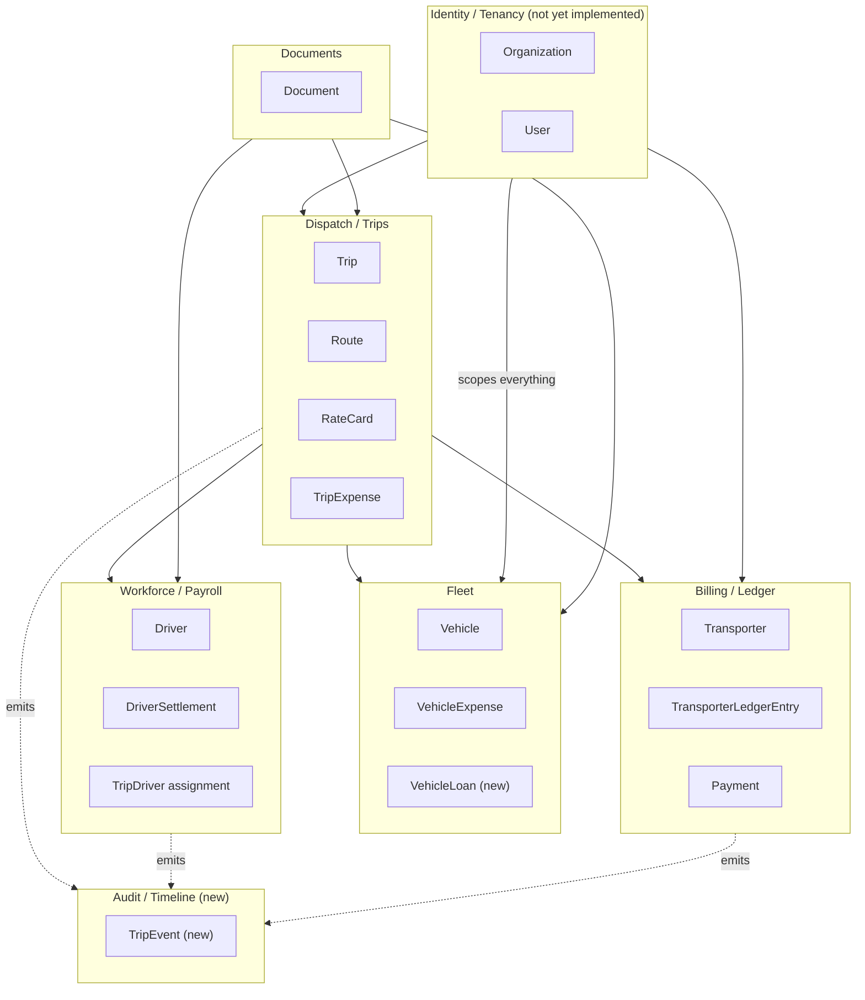

**Why this, why now:** the route files already almost respect these boundaries — the cost of formalizing them (extract `fleet.service.js`, `dispatch.service.js`, etc., move business logic out of route handlers) is low and can happen incrementally, one module at a time, with zero user-facing change. **Would I do this today or later:** later, opportunistically — bundle each module's extraction with the next feature that touches it, don't schedule a dedicated "restructuring sprint." The exception is the Identity/Tenancy context, which must exist before anything else in §10/§Migration Playbooks can land.

---

## 4. System Architecture Review

### Today
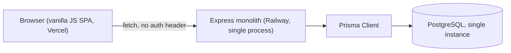
Correct for one tenant and 50K trips/year. No cache, no queue, no search service, no object storage, no monitoring beyond `console.error` — every one of these absences is *appropriate today*, not a gap, because nothing in the current usage pattern is bottlenecked by their absence.

### Target — additive, not a rewrite
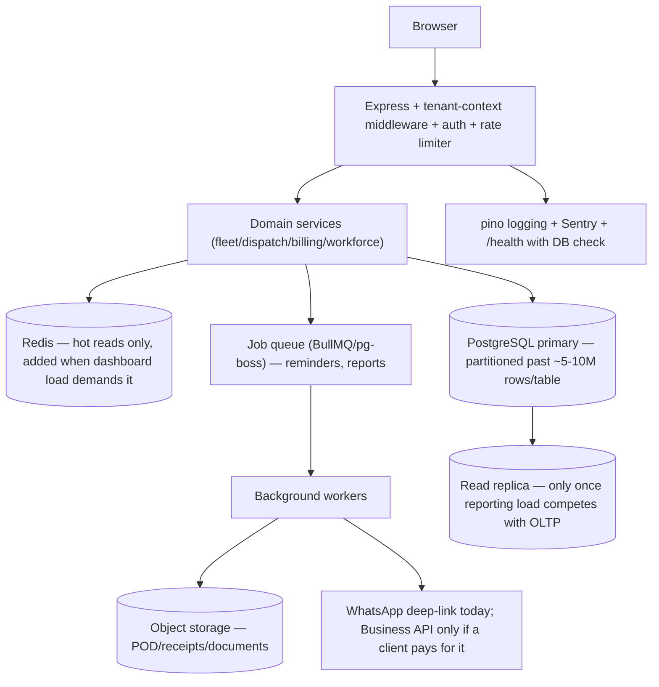

| Addition | Why | Why now vs. later | Business value | Eng cost | Ops cost | Would I do it today? |
|---|---|---|---|---|---|---|
| Tenant-context middleware | Closes the systemic security gap (§10) | **Now** — blocks the business model | Critical | Medium | Low | **Yes, immediately** |
| Structured logging + Sentry | Currently zero visibility into prod errors | Now — cheap, high value | Medium-High | Low | Low | **Yes, this month** |
| Object storage | Unblocks real POD/document upload (`multer` already installed, unused) | Now-ish — small, unblocks a real product gap | Medium-High | Low | Low | **Yes, soon** |
| Job queue + workers | Needed for reminders/reports at any real scale | **Later** — nothing needs async processing yet | Medium | Medium | Medium (new moving part) | **Not yet** — build when the first cron-shaped need (document-expiry reminders) actually arrives |
| Redis cache | Speeds hot reads at high concurrent-tenant load | **Later** — `groupBy` aggregation is fast enough today | Low today, Medium later | Low | Medium (cache invalidation is its own problem) | **Not yet** |
| Read replica | Separates reporting load from OLTP | **Much later** — only once a real reporting workload exists | Low today | Low | Medium | **No** |

This table is the template for every infra decision in this document: nothing gets added because it's available, only because a specific, named problem needs it.

---

## 5. Database Review

**Money precision (Critical):** every monetary column is `Float` (`Trip.freightAmount`, `Payment.amount`, `TransporterLedgerEntry.netReceivable`, `DriverSettlement.amount`, `VehicleExpense.amount`). Floating-point drift compounds silently across millions of `_sum`/`groupBy` aggregations (`calculations.js:33-131`) in a system whose entire value proposition is "how much money is where, right now." Fix: `Decimal(12,2)` or integer paise — see Migration Playbook A.

**Six models carry no `organizationId` at all** and rely on a join through their parent for tenant scoping: `Payment`, `DriverSettlement`, `TripExpense`, `TransporterLedgerEntry`, `VehicleExpense`, `RateCard`. This is the database-level root cause of the §10 security finding — there's no column to filter on even if a route remembered to. Denormalize it onto all six, backfilled from the parent, `NOT NULL` + FK + composite index. Standard practice in every serious multi-tenant SaaS schema (Stripe does exactly this) — not over-engineering.

**Missing composite indexes:** `Trip`'s hot query (org + status filter + createdAt sort, exactly what `trips.js:139-177` does) has three separate single-column indexes today instead of one `@@index([organizationId, status, createdAt])`. Fine at current volume; cheap to add now while other schema migrations are already in flight.

**No soft-delete; hard deletes contradict the product's own stated principle.** `PROJECT_BIBLE.md`: *"Records are corrected via adjustment, never silently deleted."* `DELETE /trips/:tripId` (`trips.js:390-401`) hard-deletes `Payment` and `TransporterLedgerEntry` rows — permanently destroying ledger history. This is the clearest gap between stated principle and actual behavior found anywhere in the codebase. Fix: `deletedAt` + immutable ledger rows — see Migration Playbook B.

**No update-audit trail** — only `Trip`/`Payment`/`Document` carry `createdById`; nothing records who changed a driver's salary or when. This is exactly what §14's event log is for.

**Already good, don't touch:** CUID keys, per-tenant unique constraints (`@@unique([organizationId, firmName])` etc. — correctly scoped, not globally unique), the single-column indexing instinct already present everywhere it currently matters.

**Partitioning/archival:** not needed yet. Trigger: a single table crossing ~5-10M rows, or nightly maintenance windows becoming noticeable — likely arrives from cross-tenant volume (10,000 tenants), not single-tenant growth. Archive beyond a retention window (7 years, matching Indian tax record-keeping norms) to cold storage, never delete outright.

---

## 6. Financial Architecture

The brief's instinct — avoid double-entry unless justified — is correct, and stays correct here. Full double-entry (chart of accounts, journals, trial balance) solves a problem this product doesn't have; the client's own language ("how much money is where, right now") is a single-entry running-balance problem, not a GAAP-compliance problem. Building double-entry would be building a mini-Tally, which `IDEAS.md` already correctly rules out as scope creep ("the transporter handles e-way bills... out of this product's job" — same logic applies to formal accounting).

**What "preserve complete financial history" actually requires is a mechanism, not a formalism:** append-only rows, corrections via a new reversing row, never an UPDATE/DELETE on a financial record. See Migration Playbook B for the concrete design.

**Driver balance sign-convention fix** (already flagged by the team as needing client sign-off, here's the concrete shape to bring to that conversation):

| SettlementType | Effect on balance owed to driver |
|---|---|
| `SALARY`, `INCENTIVE`, `ALLOWANCE` | **+** |
| `ADVANCE`, `DEDUCTION`, `PENALTY`, `CASH_COLLECTED` | **−** |

`outstanding = Σ(amount × sign[type])`, replacing the naive `Σ(amount)` in `calculateDriverOutstanding`/`calculateDriverOutstandingBulk` (`calculations.js:142-261`). Low engineering cost once confirmed; the client conversation is the actual bottleneck, not the code.

**Vehicle P&L, unblocked by one new model:**
```prisma
model VehicleLoan {
  id String @id @default(cuid())
  organizationId String
  vehicleId String
  vehicle Vehicle @relation(fields: [vehicleId], references: [id])
  lender String
  principal Decimal @db.Decimal(12,2)
  emiAmount Decimal @db.Decimal(12,2)
  emiDueDay Int
  tenureMonths Int
  startDate DateTime
  status LoanStatus @default(ACTIVE)
  @@index([organizationId, vehicleId])
}
```
EMI becomes a scheduled, auto-generated `VehicleExpense` (new `EMI` category) — the one place a background worker (§4) earns its keep early, since this is a genuinely recurring, time-triggered need rather than a request-triggered one.

**Every stated money-flow type, mapped:** freight/diesel/advances/salary/bhatta/incentive/insurance/permit/tyres/repairs/broker-commission are all already modeled (`PaymentType`, `TripExpense.category`, `SettlementType`, `VehicleExpenseCategory`). FASTag is deliberately unmodeled (`IDEAS.md`: correctly out of scope — hardware/subscription dependency the client hasn't asked for). Vehicle EMI/loan is the one real gap, addressed above. Trip/Vehicle/Company profit are blocked on that model plus the ownership fix in §1 — both addressed.

---

## 7. Scalability Review

| Milestone | First real bottleneck | Fix | Would I build this now? |
|---|---|---|---|
| 1,000 trucks / 500K trips/yr | `ILIKE` search without a trigram index; offset pagination on large ranges | `pg_trgm` GIN index; keyset pagination on high-traffic endpoints | No — build when a report actually needs to page past ~10K rows |
| 10M+ rows in one table | Un-partitioned table slows `VACUUM`/index maintenance | Monthly range partitioning | No — likely years away for one tenant, sooner in aggregate across all tenants |
| 10,000 tenants | Every query without `organizationId` denormalization becomes a full scan; connection pool exhaustion | §5's denormalization; PgBouncer; horizontally scale stateless Express instances | The denormalization — yes, cheap and unblocks §10 too. The rest — no |
| True enterprise scale | Single Postgres instance ceiling | `organizationId` as shard key (Citus or manual sharding) — the door stays open *because* it's already the leading index column everywhere | No — far enough out that designing further would be wasted effort |

**Explicitly rejected, and why:** the untracked `deep-research-report.md`'s recommendations toward Kubernetes/EKS, database-per-tenant by default, and microservices solve for a scale and team size this product isn't at, and `DECISIONS.md` #0008 already correctly defaults to row-level tenancy until a specific client demands physical isolation.

---

## 8. API Review

**Already right:** consistent REST shape, sensible sub-resources (`/trips/:id/expenses`, `/status`, `/pod`), Zod validation on every mutation, correct status codes, pagination that actually clamps (`pagination.js:6-9`).

**Gaps, in priority order, each with the cost/value framing the brief asks for:**

| Gap | Business impact if unfixed | Eng cost | Would I fix it now? |
|---|---|---|---|
| No idempotency keys on `POST /payments`/`/trips`/`/settlements` | Duplicate financial records from mobile retries on patchy highway connections — a real, not hypothetical, failure mode for this user base | Low-Medium | **Yes** — cheap, prevents a class of bug that's expensive to reconcile after the fact |
| No transactions on multi-step writes | Partial-failure data integrity bugs (orphaned trips with no ledger entry) | Low-Medium | **Yes** |
| Internal-ref generation TOCTOU race (`trips.js:310-319`) | Rare but real collision/spin under concurrent creates | Low | **Yes**, bundle with the transaction fix |
| No API versioning | None today (no external consumers) | Low | **Later** — add before any partner/webhook integration, not before |
| Offset-only pagination | Degrades at high offset depth | Low-Medium | **Later** — first hit by a "full year export" report, fix then |
| No bulk import (CSV/Excel) | Real onboarding friction for Excel-native SMEs | Medium | **Yes, soon** — high ROI, not scope creep given the stated user base |
| No rate limiting | Low risk today, real risk once public | Low | Bundle with auth work |

---

## 9. Frontend Review

The vanilla-JS decision (`DECISIONS.md` #0003) is sound and shouldn't be revisited — the team has already done the hard, valuable part (route-scoped loading, debounced filters, silent mutation refresh) that a framework would have given for free at a much higher baseline cost. Specific findings:

- **Confirmed stored-XSS surface:** no HTML-escaping utility exists anywhere in `frontend/src`. Free-text fields render unescaped into `innerHTML` (`TripDetailPage.js:51-54`, `helpers.js:81,114`). Mechanical fix — one `escapeHtml()` utility applied at every interpolation point — low cost, real risk closed. See Migration Playbook C.
- **Dead API surface:** `transporterApi.getPayments`/`addPayment` and `driverApi.getMonthlyBreakdown` (`api.js:50-51,71`) call backend routes that don't exist — confirmed against every route file, and `main.js:422-425` even documents the workaround in a comment. Delete or implement; leaving them is a trap.
- **Full `innerHTML` re-render per navigation** (`main.js:179`) — fine today, needs windowing before list pages routinely show thousands of rows. Not urgent; design it in before that threshold, not after.
- **Client-side search on master lists** — fine at hundreds of rows, needs to move server-side (as trips already are) before thousands.
- **Stated UX direction not yet built** (`TASKS.md`) — see §2, this is the highest-leverage frontend work, above any of the above bugs, because it's the thing the competitive thesis in §19 actually depends on.

---

## 10. Security Review

**Critical, fix before any second tenant:** `GET /trips`, `/payments`, `/transporter-ledger-entries`, `/vehicles`, `/drivers`, `/routes`, `/transporters` (list and detail) never filter by `organizationId` — confirmed across every route file; only `/dashboard` and `/reference-data` do. Invisible today (one `Organization` row); a systemic cross-tenant data leak the instant a second exists. This is a textbook OWASP A01 (Broken Access Control) finding, and it's more urgent than the vehicle-ownership bug because that one produces wrong numbers for one client — this one leaks one client's entire ledger to another. Fix design and full playbook in **Migration Playbook D**.

**Critical:** no auth, no RBAC enforcement. `bcryptjs`/`jsonwebtoken` installed, zero usage anywhere in `src/` (confirmed by grep). Build alongside the tenant-context fix — same seam, `DECISIONS.md` already says so.

**High:** open CORS (`app.js:8`) — harmless without auth, becomes CSRF-adjacent risk once credentialed requests exist. PII fields (`Driver.aadhaarNumber`/`panNumber`/`bankAccount`) commented "encrypted at rest" but stored as plain `String?` — real DPDP Act exposure once real Aadhaar numbers are stored; recommend masked/last-4 + hash storage over full round-tripping, simpler and safer than field-level KMS encryption for this team's size. No rate limiting anywhere, including unauthenticated `POST /seed`. No security headers (Helmet — cheap, no reason not to).

**Confirmed non-issues, stated so they aren't re-litigated:** SQL injection — not a risk, 100% Prisma-parameterized, zero raw SQL anywhere. Secrets in `docker-compose.yml` — dev-only defaults in a local compose file, not a production leak.

---

## 11. SaaS Architecture

`DECISIONS.md` #0008 already settled the big question correctly: row-level multi-tenancy by default, database-per-tenant only if a specific client demands isolation — right call, don't build the latter speculatively. What's needed to make row-level tenancy *real*: the Prisma-extension mechanism in Migration Playbook D (this is the actual enforcement layer — everything else, billing/quotas/feature-flags, sits on top of it and isn't worth building until there's a second contract to enforce it against). Tenant provisioning today is implicit (`context.js:10-22` auto-creates an org on first use) — fine for one workspace, needs an explicit provisioning flow before client #2.

---

## 12. Performance Review

This is where the codebase deserves the most credit — `CHANGELOG.md`'s route-scoped-loading rewrite and the bulk `groupBy` aggregation pattern (`calculations.js:91-131,142-188`, 2 queries instead of N+1 per transporter/driver) are genuinely correct, deliberate engineering, not luck. No N+1 found elsewhere in the read paths checked. Remaining risk is calibrated to future scale, not today: `groupBy`-based aggregation re-sums full history on every dashboard load, which is fine until millions of rows per tenant, at which point a materialized running-balance column (updated incrementally per ledger write) is the right next step — not now.

---

## 13. Workflow Review

| Workflow | State | Note |
|---|---|---|
| Trip lifecycle (`DRAFT→...→SETTLED`) | Implemented, matches docs exactly | Good doc/code consistency |
| Driver swap | Field exists (`leftAt`), never set | Client's #1 ask — see §14 |
| Expense entry | View-only in UI today | `IDEAS.md` #4, cheap fix |
| Repair/accident/breakdown | Category exists, no structured incident record | Correctly scoped as "once event log exists" (`IDEAS.md` #11) |
| Multiple unloading points | Not modeled | Worth a direct client question before building — don't assume |
| POD | URL field, not real upload | `IDEAS.md` #10 |
| Payment (partial/multiple/multi-mode) | Well-modeled | Genuine strength |
| Settlement/trip closing | Auto-advances to `SETTLED` on zero outstanding (`payments.js:76-80`) | Nice, correctly automated |
| Vehicle/driver availability check | **Not enforced** | `PROJECT_BIBLE.md` flags this itself — a vehicle can be double-booked today |

---

## 14. Event Timeline Architecture

The client's explicit #1 ask, currently entirely unbuilt. Full design (unchanged from the prior review, still the correct shape):

```prisma
enum TripEventType {
  TRIP_CREATED VEHICLE_ASSIGNED DRIVER_ASSIGNED DRIVER_SWAPPED DRIVER_REMOVED
  STATUS_CHANGED EXPENSE_ADDED ADVANCE_GIVEN PAYMENT_RECEIVED POD_UPLOADED
  ACCIDENT BREAKDOWN CHECKPOINT_REACHED DOCUMENT_EXPIRED NOTE_ADDED
}
model TripEvent {
  id String @id @default(cuid())
  organizationId String
  tripId String
  trip Trip @relation(fields: [tripId], references: [id])
  type TripEventType
  actorUserId String?
  occurredAt DateTime @default(now())
  previousValue Json?
  newValue Json?
  reason String?
  source String @default("MANUAL") // MANUAL | SYSTEM | WHATSAPP | GPS (future)
  attachmentUrl String?
  gpsLat Float?
  gpsLng Float?
  metadata Json?
  @@index([tripId, occurredAt])
  @@index([organizationId, occurredAt])
}
```
Append-only, no update/delete — same principle as the ledger. Every existing mutation gets one added `INSERT`, not a rewrite (`PATCH /trips/:tripId/status` already knows old/new status — one line at `trips.js:279-288`). The driver-swap feature is then just: set `leftAt`, create the new `TripDriver`, emit one event — closing the gap between "the field exists" and "the feature works." The trip-detail timeline becomes `SELECT * FROM TripEvent WHERE tripId=? ORDER BY occurredAt` — no separate aggregation logic, which is the actual payoff of doing the write side properly. `gpsLat`/`source` fields are placeholders for §17's future GPS integration, not a commitment to build it now.

---

## 15. Reporting & Analytics

No dedicated reports screens exist today (dashboard only). Highest-ROI, zero-schema-change report: **receivables aging** (0-15/15-30/30-60/60-90/90+ buckets on `TransporterLedgerEntry.outstandingAfter` vs. payment dates) — `IDEAS.md` #8's "You'll Get / You'll Give" framing is the right mental model for this user, not a generic AR framing. Ship this before most other reporting work; it's pure read-side work on data that already exists. Vehicle P&L and driver-statement reports are correctly blocked on §6's two fixes — don't build them early with wrong numbers.

---

## 16. Production Readiness

See scorecard at the top. Restated as a single sentence: **ready for a careful single-tenant pilot with real money today, if the Critical items land first; not ready for a second tenant under any circumstances until the tenant-isolation fix ships.**

---

## 17. Future Architecture — Extension Points

Principle: don't build these now; don't build anything today that would need to be torn out to make room for them.

| Integration | Landing spot already present? | What it needs when the day comes |
|---|---|---|
| GST/E-Way Bill/E-Invoice | N/A by design — the broker's job, not the fleet owner's | No extension point needed unless this business rule changes |
| VAHAN/SARATHI verification | Yes — raw fields already exist (`chassisNumber`, `licenseNumber`) | A verification service writing `verifiedAt`/`verificationSource` — additive |
| FASTag reconciliation | Deliberately deferred | New `VehicleExpenseCategory` value + import job when a client asks |
| PUC/insurance/fitness/permit reminders | **Already modeled**, unbuilt | Just the cron-worker + notification piece from §4 |
| GPS/AIS-140/IoT/OBD-II/TPMS/dashcams | Yes — `TripEvent.gpsLat/gpsLng/source` (§14) | A device-ingestion endpoint writing `TripEvent` rows — the event log absorbs all of these without new tables |
| Freight marketplaces/load boards | Explicitly rejected — different business model, needs `Party` promoted, twice declined by the client | No extension point needed unless the business model changes |
| Tally/Busy/Zoho Books | Not modeled | An export job (ledger rows → Tally XML/CSV) — additive |
| Bank APIs/UPI reconciliation | Partially — `Payment.referenceNumber` already captures UTR/UPI ref | A reconciliation job matching statement lines to `Payment` rows — additive |
| WhatsApp/SMS/Email/Push | `wa.me` deep links only, by design | §4's notification worker maps each `TripEvent` type to a template — additive |
| OCR (LR/POD/invoice) | Not modeled | Needs real file upload first (§4's object storage) — don't build OCR before uploads exist |
| AI (dispatch, route optimization, predictive maintenance, fraud/theft detection, driver behavior) | Explicitly deferred | `TripEvent` (§14) *is* the training-data substrate these need later — building the timeline now de-risks all of them for free |

The throughline: the two concrete recommendations that matter most in this whole document (§14's event log, §6's ledger/loan model) happen to unblock almost this entire integration wishlist without being designed for that purpose — a good sign the core instincts are sound.

---

## 18. Indian Transport Domain Validation

External domain knowledge, checked against what the repo's own docs already assume (which are already unusually accurate, likely because they came from direct client conversation rather than generic research):

- **Transporter-as-broker is exactly right** for the NCR/Haryana/Punjab/UP/Rajasthan corridor — a 5-100 truck fleet owner almost never deals directly with the factory; a broker phones/WhatsApps a load. The schema's demotion of `Party` matches this.
- **Credit cycles (15/30/45/60/90 days)** are the real driver behind the aging-report priority in §15 — brokers routinely pay 30-60+ days after POD. "You'll Get/You'll Give" is the right mental model, not "accounts receivable" — keep that language in the UI.
- **"Bank"/"Road" marker** (`DATABASE.md`'s unconfirmed guess) — very likely Bank = bank transfer, Road = cash collected physically, but a second common convention specifically means "collected by the driver en route" vs. "received by the owner directly" — these have different settlement implications (driver-collected cash affects driver cash-in-hand, per `IDEAS.md` #3). Worth confirming which the client means before modeling a field for it (correctly, nothing's been built yet on a guess).
- **Daily bhatta as a flat per-day rate** (not per-km) matches this segment's dominant practice — `Driver.dailyExpenseRate` is the right modeling choice, not a simplification needing revisiting.
- **Empty return runs/load-matching** are correctly out of scope — different business model (marketplace/network effects), the client has been asked and declined twice.
- **WhatsApp-centrality as a UX constraint, not a feature to build against** — the `wa.me` deep-link approach matches actual practice; a paid Business API integration before a client signals willingness to pay its per-message cost would be solving an unstated problem.
- **The munim's "one row per trip" ledger page** described in `PROJECT_BIBLE.md` is a very recognizable real artifact; `TransporterLedgerEntry` digitizes it correctly rather than forcing generalized invoice-first accounting.
- **What the product correctly refuses to build** — LR/bilty generator, GST/e-way bill, Tally integration, GPS/FASTag, load-board, maintenance job-card system, vendor/payables khata — every one is either genuinely the broker's job or premature relative to actual client asks. This restraint is a correct domain call; resist scope creep here even under pressure to "cover everything."

---

## 19. Product Strategy & Competitive Analysis

*Positioning below reflects general, publicly known market positioning (external knowledge, not something read in this repo) — treat specifics like pricing or exact feature lists as directionally accurate, not verified facts, and confirm anything load-bearing before quoting it externally.*

| Competitor | What they're generally known for | What they do poorly for *this* segment | What to copy | What to avoid |
|---|---|---|---|---|
| **Fleetx** | Fleet telematics + freight/TMS features, GPS-hardware-first | Assumes hardware investment (trackers) this SME segment hasn't made and Transit Ledger explicitly isn't requiring | Their fuel-efficiency/mileage reporting concept (once trip data volume supports it) | Hardware dependency as a precondition for adoption |
| **LocoNav** | GPS/IoT fleet tracking, OEM-agnostic device bundling, international reach | Same — telematics-first, not ledger-first; heavier onboarding | Multi-device integration architecture *if* a client ever buys trackers | Leading with hardware instead of the khata problem |
| **Fretron** | Enterprise/shipper-side TMS — multi-plant dispatch, control-tower visibility | Wrong customer entirely — built for large shippers coordinating many vendors, not a fleet owner running their own trucks | Their e-way bill/FASTag integration patterns, as a future reference only | Enterprise-shipper complexity, multi-plant coordination features |
| **TransportSimple** | Closer analog — LR/bilty generation, freight billing for smaller transporters | Invoice/LR-first rather than ledger-first; likely less rigorous on driver settlement/advance tracking | Nothing distinctive to copy — this is the closest direct competitor, differentiate by being *more* ledger/WhatsApp-native, not by matching features | Becoming invoice-first — that's the thing Transit Ledger correctly avoids |
| **TruckSuvidha / Vahak** | Load/truck marketplaces — classifieds connecting shippers and truck owners | Solve "find a load," not "run my books" — entirely different job-to-be-done | Their WhatsApp-adjacent, low-friction mobile UX conventions for a rural/semi-urban user base | The marketplace model itself — `IDEAS.md` already correctly rejects this, needs network effects this product doesn't have |
| **CargoERP** | Indian logistics ERP — LR/POD/GPS/billing bundle | Broader scope than a single fleet owner needs; heavier implementation | LR/POD digitization patterns, if/when LR generation is ever prioritized (explicitly deferred here) | Full-ERP scope creep |
| **ERPNext / Odoo** | Generic, open-source/commercial ERPs with configurable modules | Generic by construction — no domain language (no "bhatta," no "khata"), requires an implementation partner and ongoing configuration this segment won't pay for | Nothing — the entire competitive thesis here is "not a generic ERP" | Configurability-as-a-feature — this segment wants zero configuration, not more of it |
| **SAP TM / Oracle OTM** | Enterprise-grade transportation management for large shippers/3PLs | Wrong market entirely — cost and implementation complexity are disqualifying for a 5-100 truck SME | Nothing directly transferable | Everything about their complexity and sales motion |

**The actual white space, stated plainly:** every named competitor is either a marketplace (solves "find a load," not "run my ledger"), a telematics-first tool (solves "where is my truck," assumes hardware spend), an enterprise TMS (solves shipper-side control-tower visibility across many vendors — wrong customer), or a generic ERP (solves "run any business," at the cost of domain-specific ease of use). **None of them are ledger-first + WhatsApp-first + zero-hardware-dependency, purpose-built for the specific "I own trucks, brokers give me loads, I need to know who owes me what" business.** That's a real, defensible gap, not marketing copy — it follows directly from the domain facts already established in §1 and §18.

**Genuine competitive advantages to build on, not around:** the append-only event timeline (§14) is something no competitor at any tier combines with an immutable ledger — it's the one feature idea in this entire review that is both cheap (additive to existing mutations) and genuinely differentiated, not just table-stakes done well.

---

## 20. Innovation Review — Features Competitors Don't Have

Organized by category; each is scoped to add zero meaningful complexity to the core product — every one either reuses data that already exists in the schema or extends the event log (§14) that's being built anyway.

**WhatsApp-native (extends the existing `wa.me` pattern, no paid Business API needed for any of these):**
1. One-tap outstanding-balance reminder to a transporter, prefilled with the exact amount and trip references.
2. Auto-generated payment receipt message ("₹X received, balance ₹Y") the instant a payment is recorded.
3. Shareable driver settlement slip as a `wa.me` link — the client's own roadmap already scopes this (`IDEAS.md` #6), worth calling out as a genuine differentiator, not just a nice-to-have.
4. "Trip story" share link — a read-only, shareable version of a trip's event timeline (§14), so a transporter can see loading→transit→delivery without logging into anything.
5. Document-expiry WhatsApp nudge, sent automatically N days before insurance/PUC/fitness/permit/license expiry.

**Cash-flow visibility (pure read-side work on data that already exists):**
6. "You'll Get / You'll Give" as the actual dashboard header metric, not buried in a ledger page (`IDEAS.md` #8, already correctly scoped).
7. Aging-bucket view (0-15/15-30/30-60/60-90/90+) per transporter — the highest-ROI report in §15.
8. Driver cash-in-hand ledger — derived, not a new table: advances + diesel cash given − expenses reported − cash handed back (`IDEAS.md` #3, already correctly scoped as derived rather than stored).
9. "Money at risk" view — trips past a configurable age with zero payment recorded.
10. Weekly/monthly cash-position digest, pushed proactively rather than requiring the owner to log in and look.

**Event-timeline-derived (all free once §14 ships — this is the payoff of building it right):**
11. Full trip story feed — the client's #1 ask, delivered as a byproduct of disciplined event logging rather than bespoke UI work.
12. "What changed and who changed it" audit view on any record — driver salary, commission rate, vehicle status.
13. Driver-swap history with cash-handover amounts, visible per driver across all their trips, not just per trip.
14. Incident timeline (accident/breakdown/challan) reusing the same event/attachment mechanism as POD photos.
15. Automatic anomaly flags from event patterns — e.g., a driver flagged for unusually frequent `CASH_COLLECTED` events without matching trip revenue (a lightweight, rules-based precursor to real fraud detection, buildable without ML once the event log exists).

**Accounting/settlement, staying within "avoid double-entry unless justified":**
16. One-click monthly driver payroll run — batch-generate `SALARY` settlements for all active drivers instead of one-by-one entry.
17. Payment-allocation UI — split one incoming payment across multiple open trips at once (`IDEAS.md` #5, already scoped).
18. Vehicle P&L card once §6 unblocks it — freight share − (advances + diesel + bhatta + tolls + commission + EMI).
19. Route profitability view, once trip P&L exists — same underlying data, different aggregation.
20. Automated EMI-due reminder + auto-logged `VehicleExpense` on due date (§6, §4).

**Document & compliance (zero-schema-change, columns already exist and are unread today):**
21. Document-expiry dashboard widget — insurance/PUC/fitness/permit/license, sorted by urgency.
22. "Compliance at a glance" chip on the vehicle workspace — red/yellow/green based on nearest expiry.
23. Bulk document-renewal reminder batch, sent monthly, not per-document.

**Onboarding/migration (addresses the stated "many SMEs still use spreadsheets" reality directly):**
24. CSV/Excel bulk import for trips and master data (§8, already flagged as high-ROI).
25. A guided "import your existing khatabook" flow — map common handwritten-ledger columns (freight, bhatta, commission, Bank/Road) to the schema during onboarding, reducing the activation-energy cost of switching off paper.

**Operational (low-complexity, high daily-use value):**
26. Vehicle/driver double-booking prevention — currently unenforced (`PROJECT_BIBLE.md` flags this itself); a simple overlap check on trip assignment.
27. "Trips needing attention today" as a single prioritized list (pending POD + overdue payment + expiring document + unassigned driver), synthesizing existing dashboard signals into one actionable feed rather than four separate cards.
28. Multi-driver cash-handover confirmation step baked into the driver-swap event (§14 #13) — both drivers implicitly confirm the amount, reducing settlement disputes at source.

**Deliberately not listed here, and why:** anything requiring GPS hardware, AI/ML models trained from scratch, a load marketplace, or a paid WhatsApp Business API tier. Every one of the 28 ideas above is buildable on data the schema already has or will have once §6/§14 ship — that's the actual innovation: doing more with what's already being built, not bolting on unrelated capability. This list intentionally stays under the "20-50" ceiling at the low end, because every idea past this set starts requiring net-new infrastructure (real OCR, real GPS, real ML) that the rest of this document says should wait.

---

## 21. Complete Business Process Mapping

The trip lifecycle already implemented (`trips.js:74-83`) is the *system's* view. The *business's* view starts earlier and ends later — before the first `POST /trips` and after the last `SETTLED`. Mapping the gap matters because it's where most of the "why doesn't the software know about X" complaints in a business like this originate.

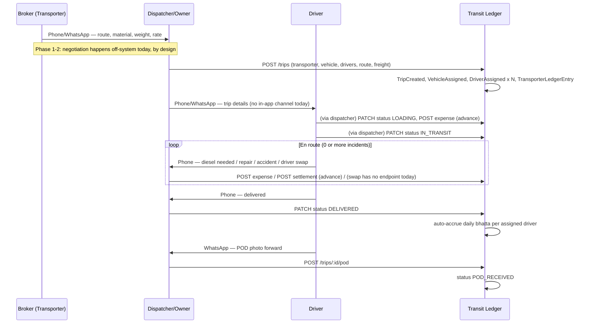

| Phase | Who | Info flow | Money flow | DB entities touched | API today | Events (§14 model) | Real failure mode | Simplification worth building |
|---|---|---|---|---|---|---|---|---|
| Inquiry & negotiation | Broker ↔ Dispatcher, phone/WhatsApp | Route, material, weight, rate — verbal | None yet | None — pre-system | None | None (system is blind here, by design) | Rate agreed verbally, never recorded, disputed later | A "quick trip draft" (rate+route only) captured at the moment of the call — cheap, closes the one real gap in this phase |
| Trip creation & assignment | Dispatcher | Transporter/vehicle/route/drivers selected | Freight set | `Trip`, `TripDriver`, `TransporterLedgerEntry` | `POST /trips` | `TRIP_CREATED`, `VEHICLE_ASSIGNED`, `DRIVER_ASSIGNED`×N | Double-booked vehicle/driver — unenforced today (§13) | Availability check at assignment time |
| Driver informed | Dispatcher → Driver | Trip summary, off-system | None | None | None | `NOTE_ADDED` (optional) | Driver never confirms receipt in-system | One-tap `wa.me` deep link with trip summary from the trip detail page |
| Loading | Driver at godown | Weight often revised from estimate | Advance/diesel handed over here | `TripExpense`, status→`LOADING` | `POST /trips/:id/expenses`, `PATCH .../status` | `STATUS_CHANGED`, `EXPENSE_ADDED` | Weight revision silently overwrites the estimate, no record of the change | Weight edits should themselves be `NOTE_ADDED` events once §14 exists |
| Transit + en-route incidents | Driver ↔ Dispatcher, phone | Incident description, sometimes a WhatsApp photo | Cash advance, repair cost | `TripExpense`, `DriverSettlement`, `TripDriver` (swap) | `POST .../expenses`, `POST /drivers/:id/settlements`; **no swap endpoint exists** | `ADVANCE_GIVEN`, `EXPENSE_ADDED`, `ACCIDENT`/`BREAKDOWN`, `DRIVER_SWAPPED` | Zero visibility between loading and delivery — this is the client's #1 complaint, restated in process terms | This entire phase *is* §14's reason to exist, plus a real `POST /trips/:id/swap-driver` endpoint |
| Delivery | Driver at destination | Confirmed by phone call | None directly | Status→`DELIVERED`, daily bhatta auto-accrued (`trips.js:87-117`) | `PATCH .../status` | `STATUS_CHANGED` | Delivery date backdated if not marked same-day | Already well automated — credit where due, the bhatta auto-accrual on delivery is a genuine existing strength |
| POD collection | Driver → Dispatcher, WhatsApp photo forward | POD photo + notes | None | `Trip.podImageUrl/podNotes`, status→`POD_RECEIVED` | `POST /trips/:id/pod` | `POD_UPLOADED` | POD photo lost in a WhatsApp thread, never forwarded — a real, common failure (§24) | Real file upload, not a URL field — already flagged high-priority |
| Billing & payment follow-up | Dispatcher/Accountant → Broker | Outstanding shared, reminders sent | Partial/full payments, multiple modes, over time | `Payment`×N, status→`BILLED`→auto`SETTLED` | `POST /payments` | `PAYMENT_RECEIVED`×N | Payment received but recorded late — dashboard overstates outstanding in the meantime | `wa.me` collection reminder (§20 #1) |
| Driver settlement | Accountant/Munim ↔ Driver | Salary/bhatta/advances reconciled | `DriverSettlement` rows | `POST /drivers/:id/settlements` | `SETTLEMENT_GENERATED` (future) | Sign-convention bug (§6) means today's number may be wrong | The §6 fix, plus a shareable settlement slip (`IDEAS.md` #6) |
| Trip closure & archive | System (automatic) + Accountant | Trip fully reconciled | None (state only) | Status→`SETTLED` | automatic | `TRIP_CLOSED` (future) | A trip closed with an unresolved discrepancy has no flag today | A "closed with exceptions" sub-state — see §22 |
| Reporting | Owner, periodically | Aggregated views | None (read-only) | Dashboard/report queries | `GET /dashboard` | none (read-side) | Fine at current volume | See §7/§12 for when this changes |

---

## 22. Entity State Machines

Not every entity deserves a formal state machine — imposing one on a record that's really just "created, then read forever" is exactly the kind of unnecessary complexity the brief warns against. Below, entities get a real FSM where the business has real states and transitions; entities that don't get one, get an explicit note on why not.

**Trip — already implemented, real states, matches docs exactly:**
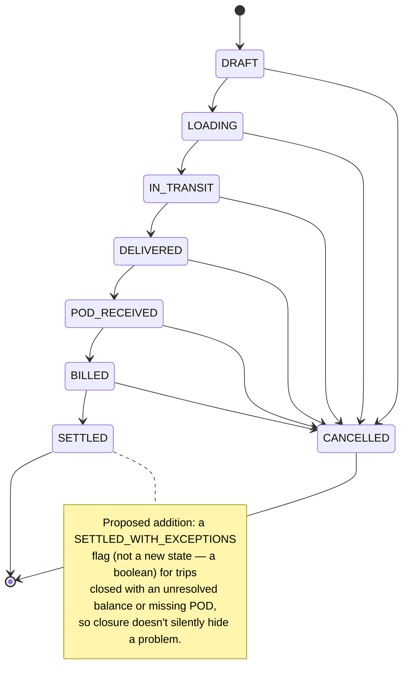

**Vehicle & Driver — availability is real today only as an *implicit*, unenforced state.** `PROJECT_BIBLE.md` itself flags "a vehicle cannot be active on two overlapping trips — not yet enforced." Proposing an explicit, derived (not stored) state:
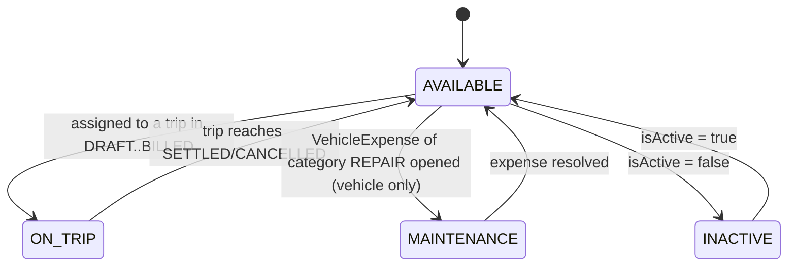
**Why derived, not stored:** storing `Vehicle.status`/`Driver.status` as a column risks drifting out of sync with the actual source of truth (open trip assignments). Compute it at read time (`SELECT` for any trip in a non-terminal status referencing this vehicle/driver) — the same instinct that already makes `computeTripPaymentSummary` correct (§12). This is the concrete mechanism behind the availability-check fix flagged in §13.

**Payment, DriverSettlement, TransporterLedgerEntry — deliberately NOT a multi-state FSM.** Per §6/Playbook B, these should be immutable once created. The only "transition" is `CREATED → REVERSED` (a new row, never an edit of the original):
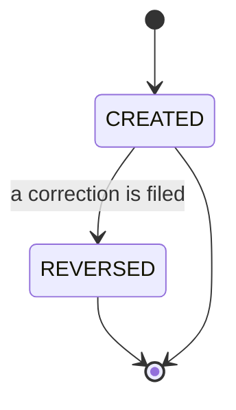
Modeling these as a rich FSM would be over-engineering — the correct pattern for financial records is immutability + reversal, not state transitions.

**Document — a real lifecycle, currently unbuilt (columns exist, nothing reads them):**
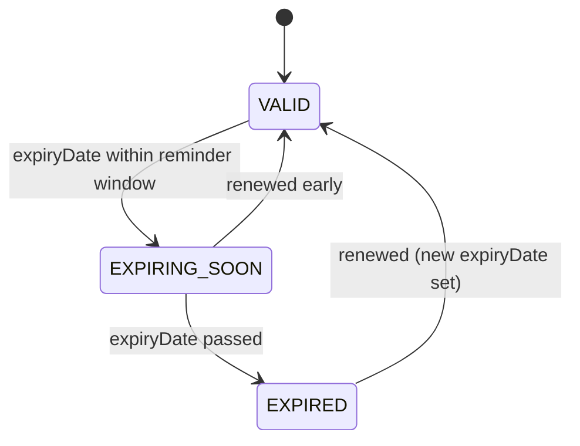
This is computed from `expiryDate` vs. today's date, not stored — same "derive, don't store" instinct as Vehicle/Driver availability.

**POD — not a separate entity today (fields live on `Trip`); its sub-lifecycle:**
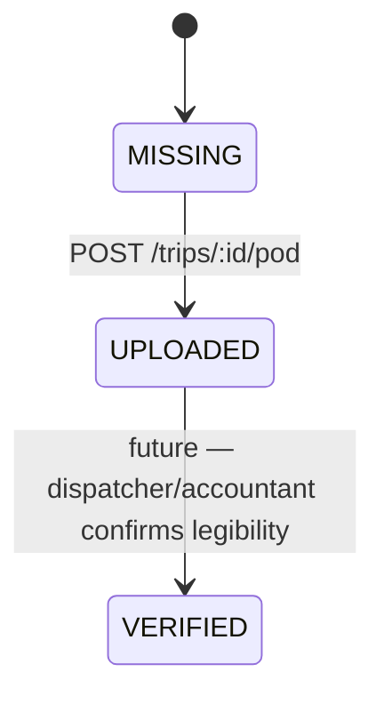

**Invoice — deliberately has no entity and no state machine.** Per the product's own "ledger not invoices" philosophy (§1/§6), there is nothing to model here — the `TransporterLedgerEntry` already serves this role. Building an `Invoice` FSM would be modeling a concept the product has correctly decided not to have.

**TripExpense/VehicleExpense — single-state records, not a lifecycle.** Created once, immutable per Playbook B, no meaningful transitions. Noting this explicitly so nobody builds an FSM for it later out of a sense that "every entity should have one" — that instinct is exactly what this section is pushing back on.

**VehicleLoan (proposed, §6):**
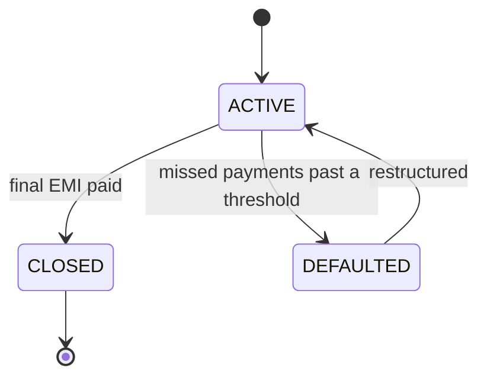

**Transporter, Organization — a boolean (`isActive`) is correct today, not a gap.** A richer Transporter lifecycle (e.g., `ACTIVE → CREDIT_HOLD → BLACKLISTED`) only becomes worth building if credit-risk management becomes a real feature request — not before. `Organization` gets a real lifecycle (`TRIAL → ACTIVE → SUSPENDED → CHURNED`) only once billing/provisioning (§11) is real — today, with one workspace, it would be pure speculation.

---

## 23. Data Flow & Event Flow

The brief's own "Payment Received" example, plus three more traced the same way — this is the actual payoff of building §14 properly: every one of these becomes a mechanical, predictable fan-out instead of bespoke logic per action.

**Payment received:**
```
POST /payments → Payment row inserted → trip's payment summary recomputed
  (computeTripPaymentSummary) → Trip.paymentStatus updated, possibly Trip.status
  auto-advances to SETTLED (payments.js:76-80) → dashboard's transporterBalances
  and paymentTotals reflect it on next load (no push today — see below) →
  [with §14] a PAYMENT_RECEIVED TripEvent is appended → [with §4's worker]
  an auto-receipt WhatsApp message is queued → [future] a reporting materialized
  view picks it up on its next refresh
```
**Gap worth naming:** there is no push/realtime update today — the dashboard reflects a payment only on its next fetch (route-scoped loading's 15s cache window, `main.js:58`). This is fine at current usage (a dispatcher refreshing a page is not a hardship) and explicitly not worth solving with WebSockets/realtime infrastructure until multiple staff are actively watching the same trip simultaneously — see §27 for when that changes the calculus.

**Trip status change → DELIVERED:**
```
PATCH /trips/:id/status → validated against STATUS_TRANSITIONS map (trips.js:74-83)
  → Trip.status updated, Trip.deliveryDate set if absent → createDailyExpensesForTrip
  runs, inserting one TripExpense (DAILY_EXPENSE) per assigned driver → those feed
  into calculateDriverOutstandingBulk on the driver's next list/detail fetch →
  [with §14] STATUS_CHANGED event appended, carrying previousValue/newValue →
  [future] a "trip delivered, POD pending" notification could fire here, closing
  the loop the dashboard's pendingPodTrips card currently only surfaces passively
```

**Driver swap (currently not implemented — this is the target flow, not today's):**
```
POST /trips/:id/swap-driver {outgoingDriverId, incomingDriverId, cashHandover}
  → outgoing TripDriver.leftAt set → incoming TripDriver row created → a
  DRIVER_SWAPPED TripEvent appended with both driver IDs + handover amount in
  newValue → outgoing driver's cash-in-hand ledger (IDEAS.md #3, derived) reflects
  the handover → trip detail page's driver list and timeline both update from the
  same write, no separate reconciliation logic needed
```

**Document expiry detected (currently not implemented):**
```
Scheduled worker (§4) queries Document/Vehicle/Driver expiry columns daily →
  for anything crossing the reminder threshold, a DOCUMENT_EXPIRED TripEvent-
  adjacent record is created (or a parallel DocumentEvent, since this isn't
  trip-scoped) → a WhatsApp reminder is queued → the dashboard's document-expiry
  widget (§15/§20 #21) reflects it on next load
```

---

## 24. Failure & Recovery Scenarios

| Scenario | Expected behavior | Recovery mechanism | Audit trail | Notification | Rollback | Consistency strategy |
|---|---|---|---|---|---|---|
| Driver absconded | Trip stays in current status, doesn't auto-cancel | Manual driver removal + reassignment | `DRIVER_REMOVED` event (§14), reason required | Owner alerted (high-severity, not routine) | N/A — forward-only correction | Outstanding advances to that driver remain visible as a debt, don't vanish |
| Vehicle stolen/truck lost | Vehicle marked `INACTIVE`, open trips flagged | Manual — this is a business event, not a system-recoverable one | Full event trail (§14) is the point — this is exactly the kind of dispute this system exists to prevent | Owner + insurer-facing document export | N/A | `VehicleLoan` (if any) doesn't auto-close — that's a separate legal process |
| Breakdown/accident | Trip stays `IN_TRANSIT`, incident logged | Manual repair/replacement, trip continues or cancels | `ACCIDENT`/`BREAKDOWN` event with attachments (§14) | Owner alerted if repair cost exceeds a threshold | N/A | Repair cost attributed correctly to vehicle vs. trip (§6 distinction) |
| Trip cancelled (by owner or broker) | `CANCELLED` is a valid transition from every non-terminal state (`trips.js:74-83`) | Already implemented correctly | `STATUS_CHANGED` event with reason | Notify transporter if freight was already committed | Any ledger entry already posted is **not** deleted — a reversal entry offsets it (Playbook B) | Preserves "never silently delete" principle even on cancellation |
| Duplicate payment (double-submit) | Should be rejected or flagged, isn't today | **No idempotency key exists yet** (§8/Migration Playbook, "Next" phase) — currently a real, live gap | None today | None today | Manual correction via a reversal `Payment` row once Playbook B lands | This is the concrete failure mode idempotency keys exist to prevent |
| Wrong payment amount entered | No `PUT /payments/:id` should ever exist (Playbook B) | A reversal + a correct new entry, both visible | Both rows visible forever | None needed — internal correction | The "rollback" *is* the reversal row, by design | This is the whole point of append-only financial records |
| Cheque bounced | `Payment.mode = CHEQUE` row should be reversible | A `REVERSED` payment row referencing the original (Playbook B) | Full trail of "paid, then bounced, then re-collected" | Alert accountant, alert dispatcher (affects trip's paymentStatus) | Reversal row, not a delete | Outstanding recalculates correctly once the reversal exists |
| UPI/bank transfer failed | Same pattern as cheque bounce | Same | Same | Same | Same | Same |
| Fuel theft (suspected) | No dedicated flow today | Manual — flag the relevant `TripExpense`/event with a note | `EXPENSE_ADDED` with an anomaly flag (§20 #15's lightweight rules-based flagging) | Owner alerted only if flagged | N/A | This is the first real use case for the anomaly-flagging idea in §20 |
| Wrong vehicle/driver assigned | Editable while trip is `DRAFT`/`LOADING` (`tripUpdateSchema` allows it) | Already supported — `PUT /trips/:id` | `VEHICLE_ASSIGNED`/`DRIVER_ASSIGNED` re-fired with previous/new value (§14) | None needed for a same-day correction | The trip update itself is the correction | Fine as-is once §14 adds the "what changed" record |
| POD lost | No recovery path today beyond re-requesting from the driver | Once real upload exists (not URL-only), the file is durably stored, not dependent on a WhatsApp thread surviving | `POD_UPLOADED` event, re-fireable if replaced | None needed | Re-upload is the recovery | This failure mode is largely *solved* by the "real upload" fix already flagged as high-priority |
| Document expired unnoticed | No alerting exists today — a real, current gap | §15/§20's expiry-alert feature | `DOCUMENT_EXPIRED` (§14-adjacent) | WhatsApp reminder before expiry, not after | N/A | Prevention, not recovery — this is the right framing for this one |
| GPS offline / no telematics | N/A — no GPS integration exists (§17, deliberately) | N/A | N/A | N/A | N/A | Not a current failure mode because it's not a current dependency |
| No internet (driver/dispatcher) | Today: request simply fails, user retries manually | See §25 — this is the offline-strategy section's whole subject | Depends on §25's design | Depends on §25 | Depends on §25 | Depends on §25 |
| Server/database unavailable | Today: 500 error, no graceful degradation | Add a `/health` check that verifies DB connectivity (currently `system.js:19-21` only checks the process is up, not the DB — a real gap); standard retry-with-backoff on the frontend | Standard infra-level logging (§4's Sentry addition) | Alert on-call (once there is an on-call — not needed at one-tenant scale) | N/A — this is an availability problem, not a data problem | Prisma transactions (Playbook A/B) already protect against partial writes during a mid-request failure |
| Concurrent edits — two dispatchers editing the same trip | No optimistic locking exists today — last write wins silently | Add an `updatedAt`-based optimistic-concurrency check (`WHERE updatedAt = :expectedUpdatedAt` on update) — low cost, real value once multiple staff are common | `STATUS_CHANGED`/edit events (§14) make the collision visible after the fact even without locking | A "this trip was just updated by X" toast on save-conflict | Reject the second write, ask the user to reload — standard optimistic-concurrency UX | Cheap to add, not urgent at today's single-user-per-trip usage pattern |
| Concurrent payments on the same trip | Each `POST /payments` is its own insert — no collision risk, this one is actually fine as-is | N/A | N/A | N/A | N/A | Append-only writes don't have the lost-update problem that in-place edits do — another argument for Playbook B beyond just audit history |
| Partial database failure mid-write | Currently possible — multi-step writes aren't transactional (§8 finding) | Playbook A/B's transaction wrapping is the fix | N/A until fixed | N/A until fixed | Transaction rollback is automatic once wrapped | This is Migration Playbook A/B's entire justification, restated as a failure scenario |

---

## 25. Offline & Low Connectivity Strategy

**Scope check, stated up front:** offline sync is explicitly out of scope today (`TASKS.md`/`IDEAS.md` both list it under "out of scope for now"), and the current web app reasonably assumes a dispatcher/accountant working from an office or a phone with adequate signal — a different context from a driver on a highway. This section designs the extension point for the future driver-facing PWA (§9/§17), not a recommendation to build offline support into today's dispatcher UI.

**Design, for when that day comes:**
- **Queued writes with idempotency keys.** Every mutation the driver app makes (status update, expense entry, POD upload) gets a client-generated idempotency key (§8) at creation time, before the network request is even attempted — so a request queued while offline and replayed later is safe to retry without risk of duplication, which is the single most important property for this specific failure mode (patchy highway connectivity, not actual extended offline periods).
- **Photo upload queue, separate from the data queue.** POD/incident photos are large relative to everything else the app sends; queue them independently with their own retry/backoff so a stuck photo upload doesn't block a small, urgent status update from going through.
- **Conflict resolution: last-write-wins is fine for almost everything here, on purpose.** A driver app has exactly one author per trip-assignment at a time (the assigned driver) — this isn't a multi-writer CRDT problem, it's a "make sure nothing gets silently dropped" problem. The one place that needs real merge logic: two queued events for the same trip in different order than they occurred (e.g., a status update and an expense entered offline, synced out of order) — the event log's `occurredAt` (client-stamped, not server-received-at) is what preserves correct ordering once §14 exists; this is another reason the event log's design already anticipates this need.
- **Local storage:** cache the driver's own assigned trips + reference data (their own profile, not the whole org) — small enough for `localStorage`/IndexedDB, no separate offline database engine needed.
- **Network recovery:** flush the queue in original order on reconnect; surface a simple "3 updates waiting to sync" indicator rather than silent background sync, so the driver has confidence the app isn't losing their input.
- **Graceful degradation today, not "offline mode":** even without building full offline support, the *current* app should fail informatively (a clear "no connection, your entry wasn't saved, try again" instead of a silent failure) — this is cheap and worth doing regardless of when the full driver-app offline story gets built.

---

## 26. Permission Matrix

The schema today has six roles (`OWNER`/`MANAGER`/`DISPATCHER`/`ACCOUNTANT`/`TRANSPORTER`/`DRIVER`, per `PROJECT_BIBLE.md`'s own RBAC table), none enforced server-side yet. The brief's ten-role list adds `Super Admin`, `Fleet Manager`, `HR`, `Operations`, `Viewer`, `Auditor`. Rather than building all ten now (which would be the over-engineering this whole review keeps warning against), here's which are worth adding at auth-launch time versus later:

| Proposed role | Add now (with auth/RBAC in Migration Playbook D)? | Reasoning |
|---|---|---|
| Owner | Yes — already exists | Sees everything |
| Manager | Yes — already exists | Covers "Fleet Manager" scope already; don't split them yet |
| Dispatcher | Yes — already exists | Trip section only |
| Accountant | Yes — already exists | Billing/ledgers/payments |
| Transporter (self-login) | Schema-ready, build the actual self-login UI later per `PROJECT_BIBLE.md` | Only their own trips/balance |
| Driver (self-login) | Schema-ready, build later, ties to §25's driver app | Only their assigned trips |
| **Super Admin** (platform-level, cross-tenant) | **Yes, add now** | This is a different concern from the other roles — it's a platform-operator role for the SaaS provider itself (you), not a customer-facing role. Needed the moment there's a second tenant, since *someone* has to be able to operate the platform across tenants without being a member of any one org. Cheap to add, structurally necessary for Migration Playbook D anyway. |
| **Viewer / Auditor** (read-only) | **Yes, add now** | Extremely cheap (it's the absence of write permissions, not new logic) and genuinely valuable for a ledger product — a client's own external accountant or a compliance reviewer needs read access without write risk. High value, near-zero cost. |
| HR | **Later** | No payroll-run/HR workflow exists yet to need a distinct role for; `Accountant` covers `DriverSettlement` today. Revisit once a real payroll module (§20 #16) exists. |
| Operations | **Later** | Overlaps heavily with Dispatcher + Manager today; a distinct "Operations" role only earns its keep once the product has enough surface area that Dispatcher's current scope is too broad — not there yet. |

**CRUD matrix for the roles being built now** (● = allowed, ○ = not allowed, △ = own-records-only):

| Module | Owner | Manager | Dispatcher | Accountant | Super Admin | Viewer/Auditor | Transporter (self) | Driver (self) |
|---|---|---|---|---|---|---|---|---|
| Vehicles/Drivers/Routes (master data) | CRUD | CRUD | Read | Read | Cross-tenant Read | Read | ○ | ○ |
| Trips | CRUD + Approve status changes | CRUD | CRUD (own dispatch scope) | Read | Cross-tenant Read | Read | △ own trips | △ assigned trips |
| Payments | CRUD | Read | ○ | CRUD | Cross-tenant Read | Read | △ own balance | ○ |
| Driver Settlements | CRUD | Read | ○ | CRUD | Cross-tenant Read | Read | ○ | △ own settlements |
| Documents | CRUD | CRUD | Read | Read | Cross-tenant Read | Read | ○ | △ own documents |
| Financial exports/reports | ● | Read-only reports | ○ | ● | Cross-tenant, own use only | Read-only | ○ | ○ |
| Organization settings/User management | ● | ○ | ○ | ○ | ● (platform-level, not org settings) | ○ | ○ | ○ |

This is deliberately not a full 10×10 cross-product — building that table before the roles it describes actually exist would itself be the over-engineering the brief warns against.

---

## 27. API Evolution Strategy

| Horizon | What's appropriate | Why not sooner |
|---|---|---|
| **Now** | REST (already the shape), Zod validation (already there), add versioning (`/api/v1/`) at the same time as auth ships — new breaking surface, right moment to start the discipline | No external consumers yet to break |
| **Year 1** | Webhooks (payment-received, document-expiring) for the first real integration partner (likely an accounting export, per §17); OpenAPI spec generated from the existing Zod schemas (low cost — the validation layer already has the shape docs need) | Nobody's asked for programmatic access yet; premature before a real partner exists |
| **Year 2-3** | A narrow, deliberately small "partner API" surface (read-only ledger export, POD retrieval) if a Tally/Zoho integration partner materializes; mobile API needs likely already satisfied by the same REST API once auth exists — a separate "mobile API" is usually unnecessary, resist building one just because mobile is a different client | Full public API + SDK is a support and versioning burden this team shouldn't take on until there's a committed partner to build it for |
| **Year 4-5** | Realtime (WebSockets or SSE) only if the product genuinely needs live multi-user trip collaboration at that point (§23 already flags this as not-yet-justified); GraphQL only if partner integrations specifically need flexible querying REST can't reasonably serve — still not a default, still needs a named reason | This is explicitly the kind of "fashionable technology" the brief says not to reach for without a business reason |
| **Ongoing discipline, cheap, start now** | Idempotency keys (§8), a deprecation policy stated in the API docs the moment `/v1/` exists (e.g., "N months notice before removing a field"), rate limits scaled to plan tier once billing exists | These cost little and get much more expensive to retrofit than to design in from the versioning point forward |

---

## 28. Database Growth Forecast

**Stated assumptions (change these and the numbers below scale linearly — the method matters more than the exact figures):** ~1 `TransporterLedgerEntry` per trip, ~3 `TripExpense` rows/trip (loading advance + a couple of en-route costs, plus the auto-generated daily-bhatta rows), ~2 `Payment` rows/trip, ~1.5 `DriverSettlement` rows/trip-equivalent, and — once §14 ships — roughly 6-8 `TripEvent` rows/trip (created, assigned, status × 4-5, POD, payment). That's **~14-16 total child rows per trip**, on top of the trip row itself.

| Scale point | Trips/year | Child rows/year (≈15×trips) | Cumulative rows @ 5 years | Storage (rows, excluding files) |
|---|---|---|---|---|
| Current (1 tenant, 100 trucks) | 50,000 | ~750,000 | ~3.75M | Low tens of MB — trivial |
| 1,000 trucks (1 tenant) | 500,000 | ~7.5M | ~37.5M | Low GB — still comfortable on a single Postgres instance with the indexes in §5 |
| **Platform at 10,000 tenants**, assuming a realistic average of ~5,000 trips/tenant/year (not every tenant runs at today's single client's volume — most SME fleets are smaller) | 50M/year across the platform | ~750M/year across the platform | **~3.75 billion rows across 5 years** | This is where the brief's "billions of ledger entries" figure actually comes from — it's a *platform-aggregate* number across many tenants, not a per-tenant number, which matters for how you read the "10M ledger entries" milestone in §7: no single tenant gets there for a very long time; the platform aggregate does, and that's a partitioning/sharding-by-tenant problem (§7), not a per-query performance problem for any one customer |

**Document/image storage (POD photos, receipts, RC/insurance/license scans):** assume ~2 images/trip average (POD + one receipt) at ~800KB average (compressed mobile photo) once real upload exists (§4/§9) — that's **~1.6MB/trip**, or **~80GB/year at 50,000 trips**, scaling to **low-hundreds-of-TB/year at full platform scale**. This is squarely object-storage territory (S3-class), never database-row territory — reinforces that the object-storage addition in §4 isn't optional once real uploads exist, it's the only sane place for this volume.

**Partitioning threshold, restated concretely from §5/§7:** the platform-aggregate numbers above cross the ~5-10M-rows-per-table partitioning trigger within the first year or two of meaningful multi-tenant scale — worth planning for at the *platform* level well before any single tenant needs it.

---

## 29. SaaS Business & Cost Model

*Illustrative, directional ranges based on general cloud-pricing knowledge (external judgment, not vendor quotes) — treat as planning inputs to revisit against real vendor pricing before committing to a plan, not as numbers to publish externally.*

| Scale | Compute + DB | Storage/CDN/backups | Notification (WhatsApp/SMS/email) | Rough monthly infra cost | Illustrative pricing tier (per-vehicle/month is the dominant model in this category) |
|---|---|---|---|---|---|
| 10-50 trucks (today's shape) | Railway's smallest tiers, as today | Negligible (no real uploads yet) | `wa.me` links — free | Tens of USD/month | Pilot/free, or a nominal flat fee — proving the product, not the unit economics, is the goal here |
| 100-500 trucks | A modestly-sized managed Postgres + a small compute tier, still comfortably single-instance | Low tens of GB, S3-class storage, cheap | Still `wa.me`-based, free | Low hundreds of USD/month | ₹150-400/vehicle/month is a plausible SME-affordable range for this category, worth validating against what `TransportSimple`-tier competitors actually charge before committing |
| 1,000+ trucks (multi-tenant, real platform scale) | Larger managed Postgres, possibly a read replica per §4's trigger, PgBouncer | Hundreds of GB-low TB, S3 + CDN for document/photo delivery | WhatsApp Business API becomes worth its per-message cost only once volume and willingness-to-pay both justify it (§17) | Low-to-mid thousands of USD/month, spread across many tenants | Same per-vehicle pricing, gross margin should still be healthy — infra cost per vehicle drops as the fixed-cost floor (one Postgres instance, one set of engineers) amortizes across more tenants, which is the core multi-tenant SaaS economic argument `DECISIONS.md` #0008 already implicitly bet on |
| 10,000 tenants / 100,000 trucks | Sharded/partitioned Postgres (Citus or manual, §7), multiple read replicas, real CDN, real object-storage lifecycle policies (archive cold data, §5) | Storage becomes a real, managed line item, not an afterthought | WhatsApp Business API now clearly justified at this volume | This is genuinely enterprise-infrastructure territory — the cost structure at this point should be modeled against real usage data from the 1,000-truck milestone, not projected from today | Same core model, likely with a higher tier for multi-branch/enterprise fleet-owner customers who've outgrown the SME segment |

**Gross margin commentary:** the biggest cost lever by far is engineering time, not infrastructure — at every scale point above, infra cost per vehicle trends toward a small fraction of a plausible ₹150-400/vehicle/month price point, which is typical and healthy for this category of vertical SaaS. The actual business risk in this model isn't infrastructure cost, it's sales/onboarding cost per SME customer (a segment that's expensive to reach and slow to convert from paper) — worth flagging as the real unit-economics question, even though it's outside this document's engineering scope.

---

## 30. Engineering Standards

| Area | Current state | Recommendation | Why now vs. later |
|---|---|---|---|
| Folder structure | Flat `routes/`, one file per domain | Evolve to the `modules/` layout proposed in §3, incrementally | Later, opportunistic — bundle with feature work, not a dedicated sprint |
| Naming conventions | Already consistent (camelCase fields, PascalCase models, plural route paths) | Formalize in a short `CONTRIBUTING.md` or fold into `DECISIONS.md` — document what's already being done correctly so it doesn't drift | Cheap, do it whenever the next contributor joins |
| Prisma migrations | `db push`, untracked, used in production start script | `prisma migrate dev` locally, `migrate deploy` in CI/prod, migrations committed to the repo | **Now** — this is Migration Playbook territory, not a someday item |
| Transactions | None on multi-step writes | `prisma.$transaction` around every multi-model write (Playbook A/B) | Now, bundled with those playbooks |
| Error handling | Centralized, clean (`errorHandler.js`) — already good | Extend the same pattern to new modules as they're added, no redesign needed | N/A — already correct |
| Logging | `console.error` only | Structured logging (pino) + Sentry (§4) | Now — cheap, high value, currently zero production visibility |
| Testing | **Zero tests** | A pragmatic pyramid: unit tests on `calculations.js` (pure functions, highest bug-value per test written), integration tests on the route handlers most likely to touch money (trips/payments/settlements), a handful of true end-to-end smoke tests — not 90% coverage everywhere, targeted at the financial-correctness surface first | Start now, but scoped — testing `calculations.js` alone would catch the sign-convention bug class before it ships next time |
| Git workflow | Not deeply audited, appears trunk-based given team size | Stay trunk-based with short-lived branches — a full GitFlow model would be ceremony this team size doesn't need | Don't change this without a real reason |
| Release strategy | Not formalized | Simple: merge to main, deploy (Railway/Vercel already do this implicitly) — add a manual "did the smoke tests pass" gate once tests exist, nothing heavier | Match process weight to team size |
| Feature flags | None | A simple env-var or single `FeatureFlag` DB table is sufficient — do not adopt a feature-flag *service* at this scale, that's solving a problem this team doesn't have | Only when the first genuinely risky feature (e.g., the RBAC rollout) needs a kill switch — likely Migration Playbook D is the first real use case |
| Code review | Not observable from the repo alone | Whatever the team already does informally is probably right-sized; the one thing worth adding is a checklist item for the financial-correctness patterns this review keeps returning to (transactions, immutability, tenant scoping) | Cheap, high-leverage — a checklist catches the exact bug classes found in this review before they recur |
| Dependency management | Small, clean dependency lists in both `package.json`s — already good | Keep it that way; resist adding a framework/library for something the team can write in an afternoon (matches the vanilla-JS philosophy already chosen) | N/A |
| Tech debt tracking | **Already exists and is genuinely good** — `TASKS.md`'s "In Progress/Not Started" sections are functioning as a tech-debt log already | Keep doing exactly this; this review's Migration Playbooks are additive line items for that same file, not a new system | N/A — don't replace something that's already working |

---

## 31. AI Readiness

**The single most important point in this section:** for a ledger product, a wrong number is worse than no number. **Prefer structured retrieval (SQL) over vector search/RAG for anything involving a balance, a total, or a specific transaction — reserve embeddings for genuinely unstructured text** (trip notes, document contents, free-text descriptions). A vector-similarity search that returns an *approximately* right outstanding balance is a liability in this product, not a feature; a constrained text-to-SQL layer that always computes the balance the same way `calculations.js` already does is not.

**What today's architecture already gets right, for free, for this future:**
- The append-only `TripEvent` log (§14) is exactly the structured, timestamped, attributed dataset an AI dispatch assistant or an "explain what happened on this trip" feature would need — it wasn't designed for AI-readiness, but it happens to be the correct substrate regardless.
- Postgres already supports `pgvector` as an extension — semantic search over `notes`/`Document` contents doesn't need a separate vector database; adding one before there's a concrete feature needing it would be exactly the premature infrastructure this whole review argues against.
- The service layer proposed in §3 (`calculations.js` as the pattern to extend) is also the right seam for a future "AI accountant": an LLM-based assistant should call the *same* `calculateDriverOutstanding`/`calculateTransporterOutstanding` functions the UI does, never re-derive the number itself — this guarantees the AI's answer and the dashboard's answer can never silently disagree.

**Concrete, non-disruptive extension points for later:**
- **Natural-language queries** → a constrained text-to-SQL layer scoped to read-only, tenant-scoped views (never raw table access) — feasible once the tenant-context mechanism in Migration Playbook D exists, since that's exactly the boundary an AI query layer must also respect.
- **OCR pipeline** (LR/POD/expense receipts) → a worker consuming the object-storage uploads from §4, writing structured fields back onto the relevant row (`TripExpense.amount` suggested-not-auto-applied, requiring human confirmation for anything financial) — human-in-the-loop by design, given the "wrong number is worse than no number" principle above.
- **AI dispatch assistant** → a thin layer over the existing trip-assignment API, suggesting (not auto-executing) vehicle/driver assignments based on availability (§22's derived state) — again, human confirms, AI suggests.
- **Predictive analytics** (maintenance, fuel efficiency) → straightforward once `VehicleLoan`/`VehicleExpense` history (§6) accumulates enough rows to model against; not viable before that data exists, so sequencing this after §6 isn't a preference, it's a hard data dependency.

**What NOT to build toward yet:** a knowledge graph (the relational schema + `TripEvent` log already model these relationships explicitly — a graph database would duplicate that, not improve it), a general-purpose chatbot (scope creep relative to any specific validated need), or fine-tuning a custom model (nothing here needs anything beyond a well-constrained RAG/text-to-SQL layer over an off-the-shelf model).

---

## 32. Long-Term Vision

**Version 2 (the next 6-12 months of this roadmap):** tenant isolation and auth are real; the event timeline ships and becomes the headline feature that differentiates Transit Ledger from every named competitor in §19; vehicle and trip P&L are trustworthy; the UX matches the product's own stated "khatabook not SAP" direction. This is "the MVP finished becoming what it always meant to be," not a new product.

**Version 5 (the multi-product stage):** a real driver-facing PWA (building on §25's offline design), WhatsApp Business API integration once volume justifies its cost (§17), an accounting-export partnership (Tally/Zoho) as the first real partner API (§27's Year 2-3 milestone), and the Innovation Review's (§20) full feature set shipped — cash-flow intelligence, document compliance automation, AI-assisted (not AI-automated) dispatch. The product is still recognizably the same ledger-first tool; it has simply stopped leaving money and time on the table that the schema was always capable of capturing.

**Version 10 (the platform stage, speculative and appropriately so):** if Transit Ledger becomes the largest fleet operating system in this segment, the natural evolution is less about new core features and more about *who else plugs into it* — a white-label offering for larger transport associations or NBFCs that finance trucks (who would want visibility into the `VehicleLoan`/EMI data this review already designed for), and potentially expansion into other markets with a structurally similar informal/SME-heavy trucking sector (parts of Southeast Asia and Africa share the broker-driven, cash-and-credit-cycle, WhatsApp-centric pattern this product is built around) — not a certainty, but a plausible extension of the same domain model, not a different product.

**What today's decisions specifically enable that future, stated so they're not accidentally undone later:**
- `organizationId`-first schema design (already the shape, just needs enforcement per Migration Playbook D) is what makes multi-tenant scale, white-labeling, and eventual sharding-by-tenant all possible without a rewrite.
- The append-only event log (§14) is what makes the AI-readiness story (§31), the audit/compliance story, and the "trip story" differentiator (§19) all the *same* piece of infrastructure — this is the single highest-leverage recommendation in this entire document, precisely because it pays for itself across so many of these sections at once.
- The deliberate refusal to build double-entry accounting, a load marketplace, GPS/telematics, or a generic-ERP feature surface (§1/§7/§17) is what keeps the product cheap enough to run and simple enough to sell into a segment that would reject anything heavier — preserving that restraint as the product grows is itself a long-term architectural decision, not just a today decision.

---

## Migration Playbooks

Full current-state/target-state/rollback detail for the highest-priority items — the ones worth this level of rigor. Lower-priority items get this treatment only once they're actually scheduled.

### Playbook A — Money precision (`Float` → `Decimal`)
- **Current state:** every monetary column is `Float`; `calculations.js` does plain JS arithmetic on them.
- **Target state:** `Decimal(12,2)` columns; `calculations.js` uses `decimal.js` (or equivalent) for all arithmetic; API responses serialize to plain numbers/strings at the boundary only.
- **Migration strategy:** additive column first (`amountDecimal`), backfilled from the existing `Float` column in a single pass, dual-write during a short transition window, cut reads over, then drop the old column. Never a blind `ALTER COLUMN` on a live financial table.
- **Rollback:** keep the old `Float` column until the new one has been live and reconciled for a full billing cycle; rollback is "read from the old column again," trivial as long as it hasn't been dropped yet.
- **Breaking changes:** API response shape for money fields may change (number → string, if using `Decimal` serialization) — coordinate with frontend in the same release.
- **Data migration:** one-time backfill script, run once, idempotent (safe to re-run).
- **Risk:** Low if done additively; High if done as a blind in-place type change on a table with real financial history.
- **Dependencies:** none — can start immediately, independent of every other playbook.
- **Implementation order:** do this early, while row counts are still small — the backfill only gets more expensive with more history.

### Playbook B — Immutable ledger + soft delete
- **Current state:** `Payment`/`DriverSettlement`/`TransporterLedgerEntry` support `DELETE`; `DELETE /trips/:tripId` hard-deletes all of them.
- **Target state:** these models never receive an application-level UPDATE or DELETE after creation; corrections are new rows of an `ADJUSTMENT`/`REVERSAL` kind referencing the original (`reversesId` self-relation); `deletedAt` added for the rare legitimate "delete a same-session draft" case.
- **Migration strategy:** add `deletedAt`/`reversesId` columns (additive, nullable, zero impact on existing rows); change the `DELETE /trips/:tripId` handler to soft-delete instead of cascading hard-deletes; add application-layer guards preventing UPDATE/DELETE on these three models outside the reversal path.
- **Rollback:** trivial — the new columns are nullable and additive; reverting the route handler to the old behavior is a one-file change if needed.
- **Breaking changes:** any code relying on `DELETE` actually removing rows (none found in the frontend beyond the generic delete-button flow, which only needs the 204 response, not row absence).
- **Data migration:** none required for existing rows — the new discipline applies to future writes only.
- **Risk:** Low.
- **Dependencies:** none, but pairs naturally with Playbook A (both touch the same financial models).
- **Implementation order:** immediately after Playbook A, same models.

### Playbook C — Frontend XSS remediation
- **Current state:** no escaping utility exists; user-controlled strings interpolate directly into `innerHTML`-bound template literals.
- **Target state:** one `escapeHtml()` utility in `utils/helpers.js`, applied at every point a user-controlled string is interpolated into an HTML string (audited file-by-file: `CardComponents.js`, `TripDetailPage.js` and siblings, `helpers.js`'s `optionList`/`navItem`).
- **Migration strategy:** add the utility, then a mechanical find-and-wrap pass, page by page — no behavior change for well-formed input, only closes the injection path for malicious input.
- **Rollback:** trivial — escaping is additive and doesn't change rendering for normal text.
- **Breaking changes:** none, unless a field was relying on rendering raw HTML on purpose (unlikely, unverified — audit during the pass).
- **Data migration:** none.
- **Risk:** Very low engineering risk; high risk in *not* doing this.
- **Dependencies:** none.
- **Implementation order:** independent, can happen in parallel with backend playbooks — different codebase, different engineer if the team splits work.

### Playbook D — Tenant isolation + auth (the flagship fix)
- **Current state:** no auth; most list/detail routes never filter by `organizationId`; `getOrganization()` grabs the first row in the table.
- **Target state:** JWT-based auth; a request-scoped tenant context (`AsyncLocalStorage`) populated by auth middleware; a Prisma Client Extension that auto-injects `where.organizationId` into every query on tenant-scoped models, so no route can forget it even in the future.
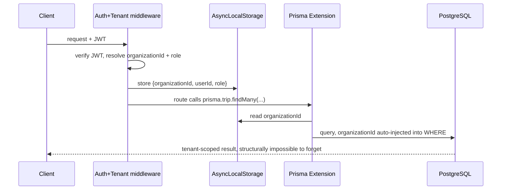
- **Migration strategy:** ship the Prisma extension and tenant-context middleware first, behind a feature flag if needed, tested against the current single-tenant data (it should be a no-op there); add JWT auth + login endpoint; add RBAC checks per route matching the existing `Role` enum documentation in `PROJECT_BIBLE.md`; only then provision a second `Organization` for real.
- **Rollback:** keep the old (unscoped) code path available behind a flag during rollout, in case the extension surfaces an unexpected query pattern that needs a fix — flip back instantly if so, fix, re-enable.
- **Breaking changes:** every request now requires an `Authorization` header; frontend needs a login flow and token storage added (currently absent) — this is the largest coordinated frontend+backend change in this entire roadmap.
- **Data migration:** backfill `organizationId` onto the six tables from Playbook-adjacent work in §5 must land *before* this, since the extension needs a column to inject `WHERE` against.
- **Risk:** Medium — this is the most invasive change in the roadmap, but the risk of *not* doing it (cross-tenant data leak) is categorically worse.
- **Dependencies:** §5's `organizationId` denormalization must land first.
- **Implementation order:** #1 overall priority, but sequenced internally as: denormalize columns → build extension + middleware (test against single-tenant data as a no-op) → add auth/login → add RBAC → only then onboard tenant #2.

---

## Implementation Timeline

**Assumption, stated explicitly so the timeline is usable rather than fake-precise:** durations below assume roughly **1–2 engineers working close to full-time**, which matches this codebase's actual signature (`DECISIONS.md` #0001 calls itself "a small team shipping a POC"). If the real team is smaller/part-time, stretch every bar proportionally — the *order* and *what-runs-in-parallel-vs-blocks* structure is the part that doesn't change with team size; only the calendar length does. Dates below start from today (2026-07-12) purely as an illustrative anchor, not a commitment.

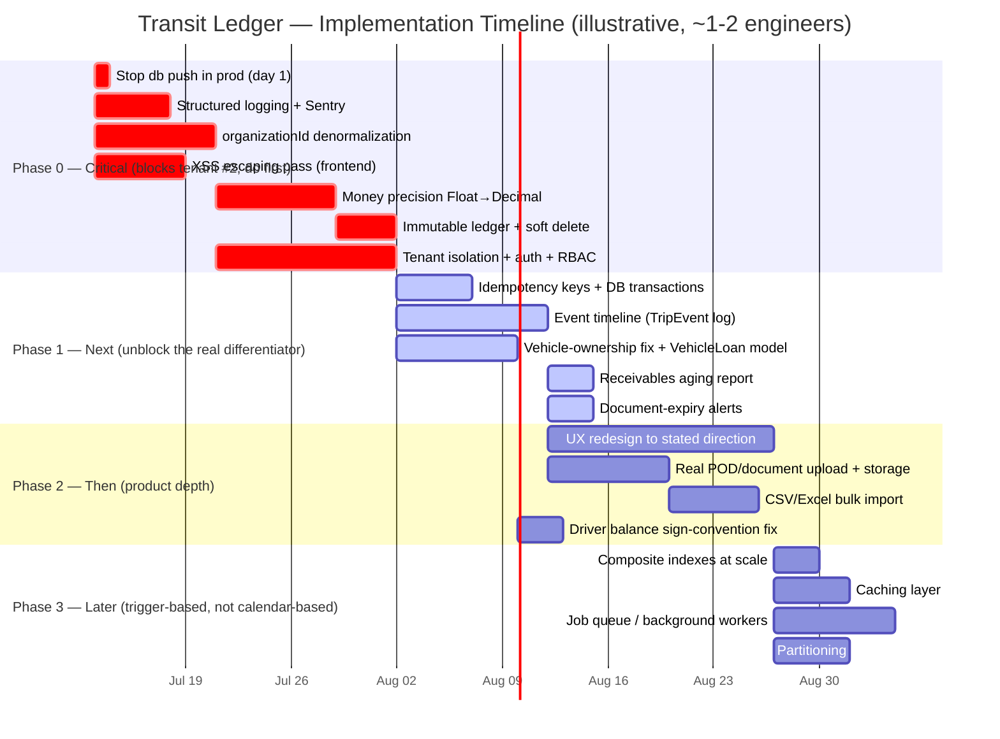

**Reading the chart:** bars on the same start date run in parallel (e.g., the logging work, the `organizationId` migration, and the frontend XSS pass don't depend on each other — three different surfaces, could even be three different people). Bars marked `after X` are hard dependencies, not just suggested ordering — e.g., money precision genuinely can't start until the `organizationId` migration is done, because both touch the same financial tables and doing them as one coordinated migration avoids touching `Payment`/`DriverSettlement` schema twice. Auth/tenant-isolation is the long pole in Phase 0 (12 days) precisely because it's the one item in this whole roadmap that touches backend, frontend, *and* requires a login UI that doesn't exist yet — everything downstream of it (Phase 1 onward) waits on it, which is why it's drawn as the critical path.

**Plain-language version of the same chart, if Mermaid doesn't render wherever you're reading this:**

| Phase | Window (illustrative) | What ships | Gate to enter next phase |
|---|---|---|---|
| **0 — Critical** | Weeks 1–5 | `db push` fix (day 1) → logging/Sentry, `organizationId` denorm, and the XSS pass run in parallel (week 1) → money precision + immutable ledger (weeks 2–3) → auth + tenant isolation + RBAC (weeks 3–5, the long pole) | No second `Organization` row until this phase is fully done — not partially, fully |
| **1 — Next** | Weeks 5–7 | Idempotency + transactions, event timeline, vehicle-ownership fix — all start once auth lands, run in parallel across the team; aging report and document-expiry alerts follow once the event timeline's plumbing exists | Event timeline shipping is the real differentiator milestone — worth treating as a launch moment, not just a backlog item |
| **2 — Then** | Weeks 7–11 (~months 2–3) | UX redesign (the longest single item — 3 weeks, touches every page), real file upload, bulk import, the driver-balance sign fix once client confirms the sign table from §6 | Product now matches its own stated design direction, not just its backend correctness |
| **3 — Later** | Ongoing, **trigger-based not date-based** | Composite indexes, caching, job queue, partitioning — each one starts only when its specific trigger condition in §7 actually fires (a slow query, a real notification-volume need), not on a calendar | N/A — this phase never "completes," it's a standing response to real load |
| **Not planned** | No date | GPS/AIS-140/IoT, WhatsApp Business API, FASTag, OCR, any ML/AI feature | Revisit only if a specific client asks and is willing to pay for it — putting these on a timeline at all would misrepresent them as scheduled work |

**Where the two "roadmaps" from the previous version live now:** the engineering work and the product work aren't actually separate tracks — the table above interleaves them on purpose (e.g., Phase 1 mixes a pure-backend item like idempotency keys with a product-facing one like the event timeline) because that's how they'll actually get built — mostly by the same one or two people, in whatever order dependencies allow, not as two independent streams.

---

*Every finding above traces to a specific file/line or a named doc; every competitor claim and domain claim is marked as external judgment, not something read in this repo. Ask for any single playbook to be expanded into an actual PR-ready diff (Prisma migration SQL, the Prisma Client Extension source, the `escapeHtml` pass) and it can be produced as a focused follow-up.*
